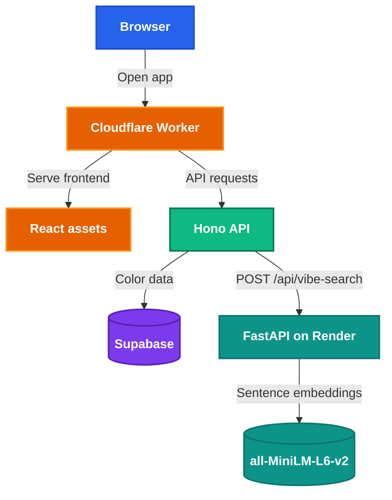

<h1 style="view-transition-name: deck-title">End to End Deployment</h1>

Part 2: Automating your deployment

---
src: ./part-1/presenter-introduction.md
---

---
layout: section
---

## Welcome back!

What we covered in Part 1:

- Deploying a web application from localhost to the internet
- Serverless deployment on Cloudflare Workers
- Connecting Supabase for database and file storage

<!--
Putt: Testing, CI/CD | Tien Cheng: Containers, Monitoring

Okay, welcome back everyone. So last week we went through how to take your app from localhost to the internet, right? We deployed a React app on Cloudflare Workers, connected Supabase for database and file storage, and at the end you had a public URL that anyone can access.

Today we're building on top of that.

[~1 min]
-->

---
layout: section
---

## Today

- Testing: make sure your app actually works
- CI/CD: automate testing and deployment
- Containers: package apps that run anywhere
- Monitoring: know when things break

<!--
So here's what we're covering today. Four main topics.

First, testing: we're going to actually write tests for the Color Swipe app you deployed last week. Then CI/CD, so instead of manually running pnpm deploy every time, we'll set it up so that when you push to GitHub, it automatically runs your tests and deploys for you.

After that, Tien Cheng will go through containers, so that's Docker, how to package your app so it runs the same way everywhere. And then monitoring, how to know when things break in production, because trust me, things will break.

Let's start with testing.

[~1 min]
-->

---
layout: section
---

## Testing

---
---

# Why test?

<div class="grid grid-cols-[1.16fr_0.84fr] gap-7 mt-5 items-start">
<div class="grid grid-cols-2 gap-6">
<div>

## Without tests

- You change something and break a different feature
- You only find bugs when users report them
- Refactoring feels dangerous
- Deploying feels scary

</div>
<div>

## With tests

- You change something and tests tell you if it broke
- You catch bugs before they reach production
- Refactoring is safe: tests are your safety net
- Deploying is boring: tests already passed

</div>
</div>
<div v-click class="mt-2">
  
</div>
</div>

<!--
Why do we write tests? Because manually clicking around the app every time you change something does not scale.

Without tests, every change is a gamble. You fix a bug in the voting logic, accidentally break the results page, and only find out when someone else tries the app. That is the debugging meme situation: the bug is real, but the path to reproducing it is messy and slow.

With tests, you turn the important checks into code. Green means the behavior we care about still works. Red means we broke a contract and we know where to start looking.

For a student project, this is not about writing a giant test suite. It is about covering the few paths that would be embarrassing to break during a demo: the API returns colors, helper functions build correct URLs, and the app can load in a real browser.

[~2 min]
-->

---
class: compact
---

# The testing pyramid

<div class="mt-6 flex flex-col items-center gap-2">
  <div v-click class="w-48 rounded-t-lg border border-[var(--nus-border)] bg-[color-mix(in_srgb,var(--nus-accent),transparent_85%)] px-4 py-3 text-center shadow-[var(--nus-shadow)]">
    <div class="font-bold text-[var(--nus-accent)]">E2E tests</div>
    <div class="nus-token-faint mt-1 text-[0.72rem]">Few · Slow · Real browser</div>
  </div>
  <div v-click class="w-72 border border-[var(--nus-border)] bg-[color-mix(in_srgb,var(--nus-success),transparent_88%)] px-4 py-3 text-center shadow-[var(--nus-shadow)]">
    <div class="font-bold text-[var(--nus-success)]">Integration tests</div>
    <div class="nus-token-faint mt-1 text-[0.72rem]">Some · Medium speed · Multiple pieces together</div>
  </div>
  <div v-click class="w-96 rounded-b-lg border border-[var(--nus-border)] bg-[var(--nus-surface)] px-4 py-3 text-center shadow-[var(--nus-shadow)]">
    <div class="font-bold text-[var(--nus-text)]">Unit tests</div>
    <div class="nus-token-faint mt-1 text-[0.72rem]">Many · Fast · One function at a time</div>
  </div>
</div>

<!--
Okay, so this is the testing pyramid. It's basically a mental model for what kinds of tests you should write and how many of each.

At the bottom, unit tests. These are the bread and butter. They test one function at a time. Like, does this function return the correct URL? They're fast, you can have hundreds of them, and they're easy to write.

In the middle, integration tests. These test multiple things working together. Like, does the API route actually query the database and return the right data?

And at the top, end-to-end tests. These simulate a real user. Opening a browser, clicking buttons, swiping cards. They're slow and can be a bit flaky, but they catch bugs that unit tests miss.

The shape tells you the ratio: lots of unit tests, some integration tests, just a few E2E tests. You don't need 50 E2E tests; we'll write a few of each so you get a feel for all three layers.

[~2 min]
-->

---
class: compact
---

# Three test types

<div class="mt-5 grid grid-cols-3 gap-4 text-[0.76rem]">
  <div v-click class="rounded-lg border border-[var(--nus-border)] bg-[var(--nus-surface)] p-4 shadow-[var(--nus-shadow)]">
    <div class="mb-2 text-lg font-bold text-[var(--nus-text)]">Unit</div>
    <div class="nus-token-faint mb-3">One small piece</div>
    <div class="font-bold">Question:</div>
    <div>Does this function return the right value?</div>
    <div class="mt-3 font-bold">Color Swipe example:</div>
    <div><code>imageUrl("red.svg")</code></div>
  </div>
  <div v-click class="rounded-lg border border-[var(--nus-border)] bg-[color-mix(in_srgb,var(--nus-success),transparent_90%)] p-4 shadow-[var(--nus-shadow)]">
    <div class="mb-2 text-lg font-bold text-[var(--nus-success)]">Integration</div>
    <div class="nus-token-faint mb-3">Multiple pieces together</div>
    <div class="font-bold">Question:</div>
    <div>Does this route use its dependencies correctly?</div>
    <div class="mt-3 font-bold">Color Swipe example:</div>
    <div><code>GET /api/colors</code> + mocked Supabase</div>
  </div>
  <div v-click class="rounded-lg border border-[var(--nus-border)] bg-[color-mix(in_srgb,var(--nus-accent),transparent_88%)] p-4 shadow-[var(--nus-shadow)]">
    <div class="mb-2 text-lg font-bold text-[var(--nus-accent)]">E2E</div>
    <div class="nus-token-faint mb-3">Whole app like a user</div>
    <div class="font-bold">Question:</div>
    <div>Can a user complete the flow in a browser?</div>
    <div class="mt-3 font-bold">Color Swipe example:</div>
    <div>Load app, see card, swipe right</div>
  </div>
</div>

<!--
Before we write code, let's make the three categories concrete.

Unit tests are the smallest. They test one function or one module with as little setup as possible. The question is: given this input, do we get this output?

Integration tests connect a few pieces. In our case, the Hono route, the Worker environment, and the Supabase client contract. We still mock Supabase because we do not want a real database in a fast test, but we test that the route wires everything together correctly.

E2E tests treat the app as a black box. They open the browser and act like a user. They are closest to the real demo, but they are slower and more expensive, so we only write a few.

[~2 min]
-->

---
class: compact scrollable-code
---

# Unit test example

Test one pure function:

```ts
import { describe, expect, it } from "vitest";
import { imageUrl } from "../../src/lib/api";

describe("imageUrl", () => {
  it("returns the API image path", () => {
    expect(imageUrl("red.svg")).toBe("/api/images/red.svg");
  });
});
```

Why this is a unit test:

- No browser
- No server
- No database
- Same input always gives the same output

<!--
This is a unit test because the boundary is tiny. We are testing `imageUrl`, and nothing else.

There is no browser, no React component, no Worker, no Supabase. The function does not know about the network. It just turns a storage key into the URL our frontend should use.

This kind of test is cheap. It runs in milliseconds, and when it fails the failure is usually obvious. If someone changes the route from `/api/images` to `/api/image`, this test catches the mismatch immediately.

The tradeoff is that a unit test cannot prove the whole app works. It only proves this small contract works.

[~2 min]
-->

---
class: compact scrollable-code
---

# Integration test example

Test an API route with a mocked dependency:

```ts
mockOrder.mockResolvedValue({ data: mockColors, error: null });
mockSelect.mockReturnValue({ order: mockOrder });

const res = await app.request(
  "/api/colors",
  {},
  {
    SUPABASE_URL: "https://test.supabase.co",
    SUPABASE_KEY: "test-key",
  },
);

expect(res.status).toBe(200);
expect(await res.json()).toEqual(mockColors);
expect(mockFrom).toHaveBeenCalledWith("colors");
expect(mockOrder).toHaveBeenCalledWith("created_at", { ascending: true });
```

<!--
This is an integration test because we are testing more than one piece together.

The request goes through the actual Hono app. The route reads Worker env bindings, creates a Supabase client, queries the `colors` table, orders by `created_at`, and returns JSON.

But we still mock Supabase. That is intentional. If this test used a real database, it would need credentials, network, seeded data, and cleanup. That makes it slower and more fragile.

So the boundary is: real route, fake external service. That is a very common integration test shape.

The assertions do two jobs. The response assertions check what the caller receives. The mock assertions check that the route used Supabase in the way we expected.

[~2.5 min]
-->

---
class: compact scrollable-code
---

# E2E test example

Test the main user flow in a browser:

```ts
import { expect, test } from "@playwright/test";

test("load page and swipe once", async ({ page }) => {
  await page.goto("/");
  await page.waitForSelector(".card");

  const card = page.locator(".deck .card").first();
  await expect(card).toBeVisible();

  const box = await card.boundingBox();
  if (!box) throw new Error("Card not found");

  await page.mouse.move(box.x + box.width / 2, box.y + box.height / 2);
  await page.mouse.down();
  await page.mouse.move(box.x + box.width + 300, box.y + box.height / 2);
  await page.mouse.up();
});
```

<!--
This is E2E because we are no longer calling functions directly. We open the app like a user.

The test does not know how `SwipeDeck` is implemented. It does not import React components. It does not call internal swipe functions. It loads the page, waits for a card, checks that the card is visible, then drags the mouse.

That makes E2E tests powerful because they catch real wiring problems: the dev server fails, CSS hides the card, JavaScript crashes, the selector disappears, or the swipe interaction breaks.

The tradeoff is cost. Browser tests are slower, and when they fail you may need screenshots or traces to debug them. That is why we write a few important E2E tests, not a giant suite of tiny browser tests.

[~2.5 min]
-->

---
---

# Vitest

- A testing framework built for **Vite** projects
- Runs your TypeScript code directly — no separate build step
- Fast: uses Vite's module resolution and caching
- API is compatible with Jest (`describe`, `it`, `expect`, `vi.mock`)

```bash
pnpm test          # run all tests once
pnpm test:watch    # re-run on file changes
```

<!--
So the testing framework we're using is Vitest. If your project uses Vite, which like most React and Vue projects do nowadays, then Vitest just plugs right in. You don't need to configure anything extra.

The API is basically the same as Jest if you've used that before. You have describe to group your tests, it to define individual test cases, and expect to check if things are correct. Pretty straightforward.

Let's actually write some tests now.

[~1 min]
-->

---
class: compact scrollable-code
---

<CheckpointBadge />

# Paste: API route tests

Open `tests/api/worker.test.ts` and replace the file:

```ts
import { beforeEach, describe, expect, it, vi } from "vitest";
import { app } from "../../src/worker";

const mockSelect = vi.fn();
const mockOrder = vi.fn();
const mockFrom = vi.fn(() => ({
  select: mockSelect,
}));

vi.mock("@supabase/supabase-js", () => ({
  createClient: vi.fn(() => ({
    from: mockFrom,
  })),
}));

describe("GET /api/health", () => {
  it("returns ok status and service name", async () => {
    const res = await app.request("/api/health");
    const body = await res.json();

    expect(res.status).toBe(200);
    expect(body).toEqual({ ok: true, service: "color-swipe" });
  });
});

describe("GET /api/colors", () => {
  beforeEach(() => {
    vi.clearAllMocks();
  });

  it("returns colors from Supabase", async () => {
    const mockColors = [
      { id: "1", name: "Red", hex: "#FF0000", upvotes: 5, downvotes: 2 },
      { id: "2", name: "Blue", hex: "#0000FF", upvotes: 3, downvotes: 1 },
    ];

    mockOrder.mockResolvedValue({ data: mockColors, error: null });
    mockSelect.mockReturnValue({ order: mockOrder });

    const res = await app.request(
      "/api/colors",
      {},
      {
        SUPABASE_URL: "https://test.supabase.co",
        SUPABASE_KEY: "test-key",
      },
    );
    const body = await res.json();

    expect(res.status).toBe(200);
    expect(body).toEqual(mockColors);
    expect(mockFrom).toHaveBeenCalledWith("colors");
    expect(mockSelect).toHaveBeenCalledWith("*");
    expect(mockOrder).toHaveBeenCalledWith("created_at", { ascending: true });
  });

  it("returns empty array when Supabase is not configured", async () => {
    const res = await app.request("/api/colors", {}, {});
    const body = await res.json();

    expect(res.status).toBe(200);
    expect(body).toEqual([]);
  });
});
```

<!--
This is the first paste block. Tell them to replace the whole file so nobody is trying to merge snippets by hand.

Start from the imports. `beforeEach`, `describe`, `it`, and `expect` are the testing vocabulary. `vi` is Vitest's mocking API. We import `app` directly from the Worker, so the test can call the routes without starting a dev server.

The `mockSelect`, `mockOrder`, and `mockFrom` functions model the Supabase chain used by the route: `from("colors").select("*").order(...)`. We keep each function in a variable because later we assert that the route called Supabase correctly.

The `vi.mock("@supabase/supabase-js", ...)` block means the real Supabase SDK never runs. No internet, no real database, no flaky credentials. The route thinks it is talking to Supabase, but it is talking to our controlled fake.

For `/api/health`, the test sends a request with `app.request("/api/health")`, reads the JSON, then checks the status and body. This is a small contract test: if someone changes the health response, the test tells us.

For `/api/colors`, the happy-path test sets mock data, passes fake Worker env bindings as the third argument to `app.request`, and checks both the response and the Supabase calls. The final test passes an empty env object and verifies the route fails gracefully by returning an empty array.

[~6 min, students paste and skim the test]
-->

---
---

<CheckpointBadge />

# Run the API tests

```bash
cd part-2/apps/web
pnpm test tests/api/worker.test.ts
```

Expected result:

```text
✓ GET /api/health > returns ok status and service name
✓ GET /api/colors > returns colors from Supabase
✓ GET /api/colors > returns empty array when Supabase is not configured
```

<!--
Now run only this test file first. This gives faster feedback and keeps failures easier to read.

If they see TypeScript or import errors, check that they are inside `part-2/apps/web` and dependencies were installed. If the Supabase expectations fail, it usually means the production route changed and the mock chain no longer matches the implementation.

The teaching point here: a good test failure should tell us which contract broke. It should not just say "something somewhere is broken".

[~2 min]
-->

---
class: compact scrollable-code
---

<CheckpointBadge />

# Paste: client helper tests

Open `tests/client/api.test.ts` and replace the file:

```ts
import { afterEach, beforeEach, describe, expect, it, vi } from "vitest";
import { imageUrl, searchVibes } from "../../src/lib/api";

beforeEach(() => {
  vi.stubGlobal("fetch", vi.fn());
});

afterEach(() => {
  vi.unstubAllGlobals();
});

describe("imageUrl", () => {
  it("returns the correct API path for a given key", () => {
    const url = imageUrl("red.svg");
    expect(url).toBe("/api/images/red.svg");
  });

  it("handles keys with subdirectories", () => {
    const url = imageUrl("colors/blue.svg");
    expect(url).toBe("/api/images/colors/blue.svg");
  });
});

describe("searchVibes", () => {
  it("posts the query to the vibe search API route", async () => {
    const response = {
      query: "rainy cyberpunk night",
      model: "test-model",
      results: [{ name: "Neon Blue", hex: "#00f5ff", score: 0.92 }],
    };

    vi.mocked(fetch).mockResolvedValue(
      new Response(JSON.stringify(response), {
        headers: { "Content-Type": "application/json" },
      }),
    );

    await expect(searchVibes("rainy cyberpunk night")).resolves.toEqual(response);
    expect(fetch).toHaveBeenCalledWith("/api/vibe-search", {
      method: "POST",
      headers: { "Content-Type": "application/json" },
      body: JSON.stringify({ query: "rainy cyberpunk night" }),
    });
  });
});
```

<!--
This file tests the client-side API helpers, meaning the functions React components call instead of manually writing fetch logic everywhere.

The `beforeEach` replaces global `fetch` with a mock before every test. The `afterEach` restores the real global after every test. That keeps tests isolated, so one test cannot accidentally affect the next.

`imageUrl` is a pure function: input string in, URL string out. These tests look tiny, but they protect the contract between frontend images and the Worker image route.

`searchVibes` is not pure because it calls `fetch`, so we mock the response. The test checks two things: first, the helper returns parsed JSON to the caller; second, it sends the exact POST request our Worker expects.

This is a useful pattern: do not test React components and network behavior at the same time if a small helper test can verify the network contract directly.

[~5 min, students paste and skim the test]
-->

---
---

<CheckpointBadge />

# Run the client tests

```bash
cd part-2/apps/web
pnpm test tests/client/api.test.ts
```

Then run the Vitest suite:

```bash
pnpm test
```

<!--
Again, run the focused file first, then the full Vitest suite.

If this fails on `fetch`, check that the import includes `vi`, `beforeEach`, and `afterEach`, and that `vi.stubGlobal("fetch", vi.fn())` is above the tests. If it fails on the expected URL or body, that is a real mismatch between the helper and the Worker API.

At this point, students have seen two levels of testing: route tests for backend behavior, and helper tests for frontend API contracts.

[~2 min]
-->

---
---

# Playwright

<div class="grid grid-cols-[1fr_0.8fr] gap-7 items-center mt-4">
<div>

- Runs your app in a **real browser**
- Simulates user behavior: navigation, clicks, typing, drag gestures
- Catches bugs unit tests miss: rendering, broken layouts, full user flows

```bash
pnpm exec playwright install --with-deps chromium
pnpm test:e2e
```

</div>
<div v-click>
  
</div>
</div>

<!--
Vitest tells us our functions and API routes behave correctly in isolation. Playwright answers a different question: if a user opens the app in a browser, does the actual product still work?

Playwright opens Chromium, navigates to the app, waits for real HTML and CSS to render, and then interacts with the page. That means it can catch issues like a missing card, a broken selector, or a layout that no unit test would ever see.

The localhost meme is the point: E2E tests are basically a robot doing the "does it work on my machine?" check, except it does it repeatably and CI can do it too.

For today, we only need one smoke test: load the app, wait for a color card, and perform one swipe. Smoke tests are not exhaustive. They are a fast answer to "is the main flow obviously broken?"

[~1.5 min]
-->

---
---

<CheckpointBadge />

# Write E2E smoke test

Open `tests/e2e/smoke.test.ts`:

```ts
import { test, expect } from "@playwright/test";

test("smoke test: load page, verify color card, swipe once", async ({ page }) => {
  await page.goto("/");
  await page.waitForSelector(".card", { timeout: 10_000 });

  const card = page.locator(".deck .card").first();
  await expect(card).toBeVisible();

  const box = await card.boundingBox();
  if (!box) throw new Error("Card not found");

  await page.mouse.move(box.x + box.width / 2, box.y + box.height / 2);
  await page.mouse.down();
  await page.mouse.move(box.x + box.width + 300, box.y + box.height / 2, { steps: 10 });
  await page.mouse.up();

  await page.waitForTimeout(500);
});
```

Install browsers and run:

```bash
pnpm exec playwright install --with-deps chromium
pnpm test:e2e
```

<!--
Open `tests/e2e/smoke.test.ts` and replace it with this snippet.

`page.goto("/")` opens the app root. The base URL comes from `playwright.config.ts`, and the config also starts the dev server before the test runs.

`waitForSelector(".card")` is important because frontend apps render asynchronously. We wait for the thing the user needs before interacting with it.

The `locator(".deck .card").first()` line finds the first card. `expect(card).toBeVisible()` checks the UI state before we start dragging.

The `boundingBox()` gives us the card's screen coordinates. The mouse sequence moves to the center, presses down, drags right, and releases. That mimics a real swipe instead of calling internal app functions.

First install Chromium with the Playwright command, then run `pnpm test:e2e`. If this fails locally, inspect the browser trace or the screenshot output. If it fails in CI, the same artifacts help you debug without guessing.

[~5 min, students install browsers and run E2E]
-->

---
layout: section
---

## CI/CD

---
---

# Right now, deploying looks like this

<div class="grid grid-cols-[1fr_0.72fr] gap-7 items-center mt-4">
<div class="flex flex-col items-center gap-3 text-[0.88rem]">
  <div v-click class="w-80 rounded-lg border border-[var(--nus-border)] bg-[var(--nus-surface)] px-4 py-3 text-center shadow-[var(--nus-shadow)]">
    <span class="font-bold">1.</span> You finish coding
  </div>
  <div v-click class="nus-token-accent text-xl font-bold">&darr;</div>
  <div v-click class="w-80 rounded-lg border border-[var(--nus-border)] bg-[var(--nus-surface)] px-4 py-3 text-center shadow-[var(--nus-shadow)]">
    <span class="font-bold">2.</span> You remember to run tests <span class="nus-token-faint">(maybe)</span>
  </div>
  <div v-click class="nus-token-accent text-xl font-bold">&darr;</div>
  <div v-click class="w-80 rounded-lg border border-[var(--nus-border)] bg-[var(--nus-surface)] px-4 py-3 text-center shadow-[var(--nus-shadow)]">
    <span class="font-bold">3.</span> You run <code class="text-[var(--nus-accent)]">pnpm deploy</code> manually
  </div>
  <div v-click class="nus-token-accent text-xl font-bold">&darr;</div>
  <div v-click class="w-80 rounded-lg border border-[var(--nus-border)] bg-[color-mix(in_srgb,var(--nus-warning),transparent_88%)] px-4 py-3 text-center shadow-[var(--nus-shadow)]">
    <span class="font-bold text-[var(--nus-warning)]">4.</span> <span class="text-[var(--nus-warning)]">You forget step 2 or 3 at some point</span>
  </div>
</div>
</div>

<!--
Okay, so in Part 1, you deployed manually, right? You ran pnpm deploy from your terminal and Wrangler uploaded everything to Cloudflare. And that works, it's fine for like one person.

But manual deployment has hidden state: you have to remember the commands, use the right branch, run the tests first, and have credentials configured on your laptop. A reminder message in Slack is not automation. It is just manual work with extra steps.

CI/CD moves those steps into a repeatable pipeline. The machine runs the same commands every time, in a clean environment, and it records exactly what happened.

[~2 min]
-->

---
---

# What is CI?

**Continuous Integration**: automatically test your code every time you change it.

<div class="mt-6 grid grid-cols-[1fr_auto_1fr_auto_1fr] items-center gap-3 text-center text-[0.82rem]">
  <div v-click class="rounded-lg border border-[var(--nus-border)] bg-[var(--nus-surface)] p-3 shadow-[var(--nus-shadow)]">
    <div class="font-bold">You push code</div>
    <div class="nus-token-faint mt-1">git push</div>
  </div>
  <div v-click class="nus-token-accent text-2xl font-bold">&rarr;</div>
  <div v-click class="rounded-lg border border-[var(--nus-border)] bg-[color-mix(in_srgb,var(--nus-success),transparent_88%)] p-3 shadow-[var(--nus-shadow)]">
    <div class="font-bold text-[var(--nus-success)]">Tests run automatically</div>
    <div class="nus-token-faint mt-1">unit + client + E2E</div>
  </div>
  <div v-click class="nus-token-accent text-2xl font-bold">&rarr;</div>
  <div v-click class="rounded-lg border border-[var(--nus-border)] bg-[var(--nus-surface)] p-3 shadow-[var(--nus-shadow)]">
    <div class="font-bold">You see results</div>
    <div class="nus-token-faint mt-1">pass or fail</div>
  </div>
</div>

<v-clicks>

## Why it matters

- You never forget to run tests — the machine doesn't forget
- Broken code is caught immediately, not days later
- Your team can see whether the codebase is healthy at a glance

</v-clicks>

<!--
So CI stands for Continuous Integration. The idea is pretty simple: every time you push code to GitHub, a machine automatically picks it up, installs your dependencies, and runs your test suite. If everything passes, green checkmark. If something fails, red X.

The "continuous" part means it happens on every push, not just when you remember. So let's say you're working on your orbital project at like 1 AM, you push some code, and you accidentally broke something. CI catches it immediately, you can fix it then instead of finding out a week later when your advisor tries the demo.

[~2 min]
-->

---
---

# What is CD?

**Continuous Deployment**: automatically deploy your code every time tests pass.

<div class="mt-6 grid grid-cols-[1fr_auto_1fr_auto_1fr_auto_1fr] items-center gap-3 text-center text-[0.82rem]">
  <div v-click class="rounded-lg border border-[var(--nus-border)] bg-[var(--nus-surface)] p-3 shadow-[var(--nus-shadow)]">
    <div class="font-bold">Push code</div>
  </div>
  <div v-click class="nus-token-accent text-xl font-bold">&rarr;</div>
  <div v-click class="rounded-lg border border-[var(--nus-border)] bg-[color-mix(in_srgb,var(--nus-success),transparent_88%)] p-3 shadow-[var(--nus-shadow)]">
    <div class="font-bold text-[var(--nus-success)]">Tests pass</div>
  </div>
  <div v-click class="nus-token-accent text-xl font-bold">&rarr;</div>
  <div v-click class="rounded-lg border border-[var(--nus-border)] bg-[color-mix(in_srgb,var(--nus-accent),transparent_85%)] p-3 shadow-[var(--nus-shadow)]">
    <div class="font-bold text-[var(--nus-accent)]">Deploy automatically</div>
  </div>
  <div v-click class="nus-token-accent text-xl font-bold">&rarr;</div>
  <div v-click class="rounded-lg border border-[var(--nus-border)] bg-[var(--nus-surface)] p-3 shadow-[var(--nus-shadow)]">
    <div class="font-bold">Live in production</div>
  </div>
</div>

<v-clicks>

## Why it matters

- Deploying becomes boring and predictable
- No one needs to remember the deploy steps
- Your production always matches your latest tested code

</v-clicks>

<!--
And then CD, Continuous Deployment, takes it one step further. After your tests pass, the system automatically deploys your code to production. No human needed.

So the full pipeline is: you push code, tests run, if tests pass, code deploys. You just write code and push. Everything else is automated.

Some teams use "Continuous Delivery" instead, which means the deploy is ready but needs one click to approve. For orbital projects, full automatic deployment is fine, it's not like you have millions of users who'll be affected, right?

[~2 min]
-->

---
---

# GitHub Actions

GitHub's built-in CI/CD platform. No extra tools to install.

<div class="mt-6 grid grid-cols-2 gap-4 text-[0.82rem]">
  <div v-click class="rounded-lg border border-[var(--nus-border)] bg-[var(--nus-surface)] p-4 shadow-[var(--nus-shadow)]">
    <div class="font-bold text-[var(--nus-accent)]">Workflow</div>
    <div class="nus-token-faint mt-1">A YAML file in <code>.github/workflows/</code> that defines the entire pipeline</div>
  </div>
  <div v-click class="rounded-lg border border-[var(--nus-border)] bg-[var(--nus-surface)] p-4 shadow-[var(--nus-shadow)]">
    <div class="font-bold text-[var(--nus-accent)]">Job</div>
    <div class="nus-token-faint mt-1">A set of steps that run on a fresh virtual machine (e.g., <code>ubuntu-latest</code>)</div>
  </div>
  <div v-click class="rounded-lg border border-[var(--nus-border)] bg-[var(--nus-surface)] p-4 shadow-[var(--nus-shadow)]">
    <div class="font-bold text-[var(--nus-accent)]">Step</div>
    <div class="nus-token-faint mt-1">A single command or action within a job (e.g., <code>pnpm test</code>)</div>
  </div>
  <div v-click class="rounded-lg border border-[var(--nus-border)] bg-[var(--nus-surface)] p-4 shadow-[var(--nus-shadow)]">
    <div class="font-bold text-[var(--nus-accent)]">Trigger</div>
    <div class="nus-token-faint mt-1">The event that starts the workflow (e.g., <code>push</code>, <code>pull_request</code>)</div>
  </div>
</div>

<!--
So the tool we're using for CI/CD is GitHub Actions. It's GitHub's built-in CI/CD platform, so you don't need to sign up for anything extra, it's already there in every repo.

The concepts are pretty simple. A workflow is a YAML file in .github/workflows/ that defines the pipeline. A job is a set of steps that run on a fresh virtual machine, so it's like a clean computer every time, nothing from your laptop. A step is a single command, like "run pnpm test". And a trigger is what kicks it off: pushing to a branch, opening a PR, that sort of thing.

Let's look at what our workflow actually looks like.

[~2 min]
-->

---
class: compact scrollable-code
---

# Our workflow

```yaml
name: Color Swipe CI/CD

on:
  push:
    branches: [main]
  pull_request:
    branches: [main]

jobs:
  test:
    runs-on: ubuntu-latest
    defaults:
      run:
        working-directory: part-2/apps/web
    steps:
      - uses: actions/checkout@v4
      - uses: pnpm/action-setup@v4
        with: { version: 10 }
      - uses: actions/setup-node@v4
        with:
          node-version: 22
          cache: pnpm
          cache-dependency-path: part-2/apps/web/pnpm-lock.yaml
      - run: pnpm install
      - run: pnpm test
      - run: pnpm exec playwright install --with-deps chromium
      - run: pnpm test:e2e
        env:
          SUPABASE_URL: ${{ secrets.SUPABASE_URL }}
          SUPABASE_KEY: ${{ secrets.SUPABASE_KEY }}

  deploy:
    needs: test
    if: github.ref == 'refs/heads/main'
    runs-on: ubuntu-latest
    defaults:
      run:
        working-directory: part-2/apps/web
    steps:
      - uses: actions/checkout@v4
      - uses: pnpm/action-setup@v4
        with: { version: 10 }
      - uses: actions/setup-node@v4
        with:
          node-version: 22
          cache: pnpm
          cache-dependency-path: part-2/apps/web/pnpm-lock.yaml
      - run: pnpm install
      - run: pnpm deploy
        env:
          CLOUDFLARE_API_TOKEN: ${{ secrets.CLOUDFLARE_API_TOKEN }}
          SUPABASE_URL: ${{ secrets.SUPABASE_URL }}
          SUPABASE_KEY: ${{ secrets.SUPABASE_KEY }}
```

<!--
Okay let me walk through this YAML file.

At the top, the trigger: it runs on push to main AND on pull requests targeting main. So if you open a PR, it runs the tests but doesn't deploy. Only pushing to main triggers the actual deploy.

The test job: checks out the code, sets up pnpm and Node, installs deps, runs Vitest, installs Playwright, runs E2E tests. The Supabase credentials come from GitHub secrets, which we'll set up in a moment.

The deploy job: see where it says "needs: test"? That means it only runs after the test job passes. And "if: github.ref == 'refs/heads/main'" means it only deploys on pushes to main, not on PRs. Makes sense, right? You don't want every PR deploying to production.

The working-directory is set because our app lives in a subdirectory of the repo.

[~3 min]
-->

---
---

# Secrets in GitHub Actions

Your workflow needs credentials to deploy. **Never put secrets in code.**

<div class="mt-6 grid grid-cols-2 gap-6 text-[0.82rem]">
<div>

## Where to add them

<v-clicks>

1. Your fork on GitHub
2. **Settings** → **Secrets and variables** → **Actions**
3. **New repository secret**

</v-clicks>

</div>
<div>

## What to add

<v-clicks>

- `CLOUDFLARE_API_TOKEN` — deploy permission
- `SUPABASE_URL` — your project URL
- `SUPABASE_KEY` — your publishable key

</v-clicks>

</div>
</div>

<v-click>

Secrets are accessed as `${{ secrets.SECRET_NAME }}` in the workflow YAML.

</v-click>

<!--
So your workflow needs credentials to deploy and run tests, right? Things like the Cloudflare API token, Supabase URL and key. And you should never put these in your code, don't hardcode them in the YAML file.

GitHub Actions has a secrets feature. You go to your repo settings, Secrets and variables, Actions, and add them there. Once added, your workflow accesses them with this dollar-curly-brace syntax, but nobody can read the actual values.

We need three secrets: Cloudflare API token for deploying, and Supabase URL and key for the E2E tests.

The Cloudflare API token is different from what you used with wrangler login, you need to create a dedicated one in the Cloudflare dashboard. I'll show you how.

[~2 min]
-->

---
class: compact scrollable-code
---

<CheckpointBadge />

# Paste: workflow template answers

Open `.github/workflows/deploy-color-swipe.yml` in your repo.

Replace the `____` blanks with these blocks:

```yaml
on:
  push:
    branches: [main]
  pull_request:
    branches: [main]
```

```yaml
- name: Run tests
  run: pnpm test

- name: Install Playwright browsers
  run: pnpm exec playwright install --with-deps chromium

- name: Run E2E tests
  run: pnpm test:e2e
```

```yaml
if: github.ref == 'refs/heads/main'
```

```yaml
- name: Deploy
  run: pnpm deploy
```

<!--
This is the CI/CD paste section. The template already has the structure, so students only need the missing pieces.

The first block is the trigger. Pushes to `main` should test and deploy. Pull requests targeting `main` should test only.

The second block is the test job. `pnpm test` runs Vitest. The Playwright install step downloads the Chromium browser inside GitHub's runner. `pnpm test:e2e` then runs the browser smoke test.

The third block is the deploy guard. `github.ref == 'refs/heads/main'` prevents PRs and feature branches from deploying to production.

The last block is the deploy command. It uses the same `pnpm deploy` command students ran manually in Part 1, but now GitHub Actions runs it after the tests pass.

Ask them to compare this with the full workflow slide: CI is just commands they already know, written down in YAML.

[~5 min, students fill in the template]
-->

---
---

<CheckpointBadge />

# Configure secrets

Add three secrets to your GitHub repository:

| Secret name | Where to get it |
|---|---|
| `CLOUDFLARE_API_TOKEN` | [Cloudflare dashboard → API Tokens](https://dash.cloudflare.com/profile/api-tokens) → Edit Cloudflare Workers template |
| `SUPABASE_URL` | Supabase dashboard → Settings → API |
| `SUPABASE_KEY` | Supabase dashboard → Settings → API |

Go to your fork → **Settings** → **Secrets and variables** → **Actions** → **New repository secret**

<!--
Alright, now add the secrets. Go to your fork on GitHub, Settings, Secrets and variables, Actions, New repository secret.

For the Cloudflare API token, go to the Cloudflare dashboard, Profile, API Tokens, use the "Edit Cloudflare Workers" template. Copy the token and add it as a GitHub secret.

For Supabase, use the same URL and publishable key from Part 1. You can find them in your Supabase dashboard under Settings, API.

[~5 min, students configure secrets]
-->

---
---

<CheckpointBadge />

# Push and trigger the pipeline

Commit the completed workflow and push to `main`:

```bash
git add .github/workflows/deploy-color-swipe.yml
git commit -m "ci: add CI/CD pipeline for color-swipe"
git push origin main
```

Then go to your fork on GitHub → **Actions** tab.

Checkpoint:

- The workflow appears in the Actions tab
- The `test` job runs and all tests pass
- The `deploy` job runs and deploys to Cloudflare Workers
- Your app is live at the same `workers.dev` URL from Part 1

<!--
Alright, moment of truth. Commit the completed workflow file and push to main.

Then go to your fork on GitHub, click the Actions tab, and you should see the workflow running. The test job runs first: installing deps, running Vitest, installing Playwright, running E2E tests. If everything passes, the deploy job kicks off.

First run might take a few minutes because it needs to install everything from scratch. Future runs are faster thanks to caching.

If the deploy fails, check the CLOUDFLARE_API_TOKEN secret. If tests fail, click into the job logs to see what happened.

[~5 min, students push and verify pipeline]
-->

---
layout: section
---

## This is just the start

<!--
Quick pause before we move to containers.

What we just built is intentionally small: a few tests, one GitHub Actions workflow, one automatic deployment. That is enough to be useful for an Orbital project, but testing and CI/CD are both much bigger topics in real teams.

I want to show you the map so you know what exists beyond today's workshop.

[~30 sec]
-->

---
class: compact
---

# Testing: what we did vs what teams add

<div class="mt-5 grid grid-cols-2 gap-5 text-[0.78rem]">
<div class="rounded-lg border border-[var(--nus-border)] bg-[var(--nus-surface)] p-4 shadow-[var(--nus-shadow)]">

## Today

- Unit test for a URL helper
- Integration test for API routes
- One E2E smoke test
- Mocked external services
- Run tests locally and in CI

</div>
<div class="rounded-lg border border-[var(--nus-border)] bg-[color-mix(in_srgb,var(--nus-accent),transparent_90%)] p-4 shadow-[var(--nus-shadow)]">

## Later

- Test data factories and fixtures
- Visual regression tests
- Accessibility tests
- Contract tests between services
- Coverage thresholds
- Flaky test quarantine

</div>
</div>

<!--
Today we covered the core loop: write tests, run tests, use CI to stop broken code from deploying.

But real test suites grow extra machinery around that loop.

Fixtures and factories help you create repeatable test data without copying giant objects everywhere. Visual regression tests compare screenshots so you catch accidental UI changes. Accessibility tests check things like labels, contrast, and keyboard navigation.

Contract tests matter once you have multiple services. For example, our Worker expects Vibe Search to return `{ query, model, results }`. A contract test can catch breaking API changes before deployment.

Coverage thresholds are useful, but don't worship the number. 90 percent coverage with bad tests is worse than 60 percent coverage around important flows. Coverage tells you what code ran, not whether the assertions were meaningful.

Flaky test quarantine is a real thing in teams: if a test sometimes fails for no product reason, you either fix it quickly or isolate it, because flaky tests train people to ignore red builds.

[~3 min]
-->

---
class: compact
---

# CI/CD: what we did vs what teams add

<div class="mt-5 grid grid-cols-2 gap-5 text-[0.78rem]">
<div class="rounded-lg border border-[var(--nus-border)] bg-[var(--nus-surface)] p-4 shadow-[var(--nus-shadow)]">

## Today

- Run on push and pull request
- Install dependencies
- Run Vitest and Playwright
- Deploy only after tests pass
- Store credentials as secrets

</div>
<div class="rounded-lg border border-[var(--nus-border)] bg-[color-mix(in_srgb,var(--nus-success),transparent_90%)] p-4 shadow-[var(--nus-shadow)]">

## Later

- Required checks before merge
- Preview deployments per PR
- Staging and production environments
- Manual approvals for risky deploys
- Rollbacks and release tags
- Build artifacts and caches

</div>
</div>

<!--
Same thing for CI/CD. Today we made a basic pipeline: push code, run tests, deploy if green.

In real projects, the pipeline becomes part of the team's safety system.

Required checks mean GitHub will not let you merge unless the tests pass. Preview deployments give every pull request its own temporary URL, so reviewers can click around before merging.

Staging and production environments let you test against a production-like setup without affecting real users. Some teams deploy automatically to staging but require manual approval for production.

Rollbacks matter because even tested code can break in production. A good deployment process should answer: what version is live, what changed, and how do we go back quickly?

Artifacts and caches are about speed and repeatability. Instead of rebuilding the same thing repeatedly, you can build once, store the output, test that exact output, then deploy that exact output.

[~3 min]
-->

---
class: compact
---

# Where to spend effort first

<div class="mt-5 grid grid-cols-[1fr_1fr_1fr] gap-4 text-[0.76rem]">
  <div v-click class="rounded-lg border border-[var(--nus-border)] bg-[var(--nus-surface)] p-4 shadow-[var(--nus-shadow)]">
    <div class="mb-2 text-lg font-bold text-[var(--nus-text)]">1. Critical paths</div>
    <div>Test the flows that would ruin your demo if they broke.</div>
    <div class="mt-3 nus-token-faint">Login, payment, upload, booking, search, deploy.</div>
  </div>
  <div v-click class="rounded-lg border border-[var(--nus-border)] bg-[var(--nus-surface)] p-4 shadow-[var(--nus-shadow)]">
    <div class="mb-2 text-lg font-bold text-[var(--nus-text)]">2. Boundaries</div>
    <div>Test where your app talks to other systems.</div>
    <div class="mt-3 nus-token-faint">Database, storage, AI service, email, payment API.</div>
  </div>
  <div v-click class="rounded-lg border border-[var(--nus-border)] bg-[var(--nus-surface)] p-4 shadow-[var(--nus-shadow)]">
    <div class="mb-2 text-lg font-bold text-[var(--nus-text)]">3. Automation</div>
    <div>Run the same checks every time without relying on memory.</div>
    <div class="mt-3 nus-token-faint">CI checks, branch protection, deploy gates.</div>
  </div>
</div>

<!--
If this feels like a lot, here is the practical order.

First, test critical paths. For your Orbital project, ask: what would be embarrassing if it broke during Splashdown or a live demo? Start there.

Second, test boundaries. Bugs often happen where systems meet: frontend to backend, backend to database, Worker to Render, app to Supabase.

Third, automate the checks. A test that only runs when you remember is useful, but a test that runs on every PR is much more useful.

Do not try to build a huge enterprise process for a student project. Build the smallest safety net that catches the bugs you are actually likely to ship.

[~2 min]
-->

---
class: compact
---

# A good pipeline answers four questions

<div class="mt-6 grid grid-cols-2 gap-4 text-[0.82rem]">
  <div v-click class="rounded-lg border border-[var(--nus-border)] bg-[var(--nus-surface)] p-4 shadow-[var(--nus-shadow)]">
    <div class="font-bold text-[var(--nus-accent)]">Is it correct?</div>
    <div class="nus-token-faint mt-1">Tests, type checks, linting, security scans</div>
  </div>
  <div v-click class="rounded-lg border border-[var(--nus-border)] bg-[var(--nus-surface)] p-4 shadow-[var(--nus-shadow)]">
    <div class="font-bold text-[var(--nus-accent)]">Can we ship it?</div>
    <div class="nus-token-faint mt-1">Builds, environment config, deploy credentials</div>
  </div>
  <div v-click class="rounded-lg border border-[var(--nus-border)] bg-[var(--nus-surface)] p-4 shadow-[var(--nus-shadow)]">
    <div class="font-bold text-[var(--nus-accent)]">What changed?</div>
    <div class="nus-token-faint mt-1">Commits, release notes, artifacts, version tags</div>
  </div>
  <div v-click class="rounded-lg border border-[var(--nus-border)] bg-[var(--nus-surface)] p-4 shadow-[var(--nus-shadow)]">
    <div class="font-bold text-[var(--nus-accent)]">Can we recover?</div>
    <div class="nus-token-faint mt-1">Rollbacks, alerts, logs, monitoring</div>
  </div>
</div>

<!--
This is the broader mental model for CI/CD.

First: is it correct? That is tests, type checks, linting, maybe security scans.

Second: can we ship it? That is whether the app builds, has the right environment variables, and has credentials to deploy.

Third: what changed? When production breaks, you need to know what commit or release introduced the change.

Fourth: can we recover? Deployment is not complete unless you know what to do when the new version is bad.

That last point leads naturally into the second half of today. Containers help us package services consistently. Monitoring helps us know when production is actually broken.

[~2 min]
-->

---
layout: section
---

## Containers

---
layout: default
class: compact
---

# It works on my machine?

<WorksOnMyMachineFlow />

<!--
Okay so, I'm going to take over from Putt here for containers and monitoring.

So who here has had the experience where you build something on your machine, it works perfectly, and then your teammate clones the repo, runs it, and something's broken? Maybe they have a different version of Python, or they're missing some system dependency.

This is like the most classic problem in software development, right? "It works on my machine" ... yeah but it doesn't work on anyone else's. That's the problem containers solve.

[~2 min]
-->


---
layout: two-cols-header
---

# Containers

::left::

- Package code, runtime, OS libraries, and large assets into **one image**
- If it runs in the image on your laptop, it should run the same way in production

::right::


<!--
So containers are basically a way to package your code, your runtime, your OS libraries, everything your app needs, into one single image. And if it runs in the container on your laptop, it's gonna run the same way on your teammate's laptop, on the server, wherever.

It's like instead of saying "here's my code, figure out how to run it," you're saying "here's a box that contains everything, just run the box."

Callback to the Docker meme from Part 1, right?

[~1.5 min]
-->

---
layout: two-cols-header
---

# Why containers?  
Serverless is great until the runtime boundary becomes the problem

::left::

## Cloudflare Worker

- Tiny deploy artifact
- Platform handles scaling and backend ops
- Pay only when code runs
- Local testing may not match production perfectly

::right::

## Container

- Packages app + runtime + system dependencies
- Runs like a normal Linux service
- More control over languages, libraries, and memory
- Easier to test locally: same image runs in prod

<!--
So you might be wondering, wait, we already deployed on Cloudflare Workers, that was serverless, why do we need containers?

Serverless is great, we showed that in Part 1, right? You just push your code and it runs. But there are limits. Like Cloudflare Workers gives you 128 MB of memory. That's fine for an API, but what if you want to run a machine learning model? Or what if you need Python with specific system libraries?

Containers give you more control. You can use whatever language, install whatever dependencies, and you can test it locally knowing it'll work the same in production.

Think of serverless and containers as different tools for different jobs. For our API and React app, serverless is great. For the AI microservice we're about to build, we need a container.

[~2 min]
-->

---
---

# Every app needs AI now right?
- Let's add some AYY EYE features to Color Swipe
- Vibe Search: type in a sentence and we find the color that vibes best with your text
- Because we're RESUMEMAXXING, we're going to implement this feature with a Python Microservice that calls a self hosted model
- Can we just do it on Workers?

<svg class="workers-limits-meme-filters" aria-hidden="true" width="0" height="0">
  <defs>
    <filter id="workers-meme-knockout" color-interpolation-filters="sRGB">
      <feColorMatrix
        in="SourceGraphic"
        type="matrix"
        values="1 0 0 0 0  0 1 0 0 0  0 0 1 0 0  -1.1 -1.1 -1.1 3.2 0"
      />
    </filter>
  </defs>
</svg>

<div
  class="workers-limits-meme"
  role="img"
  aria-label="Cloudflare Workers limits with reaction over 128 MB memory limit"
>
  
  <div class="workers-limits-meme__sticker" aria-hidden="true">
    
  </div>
</div>

<!--
Okay so, every app needs AI now, right? Like you can't ship anything without some AI feature or your resume doesn't look as impressive.

So we're going to add a Vibe Search feature to Color Swipe. You type in like "ocean breeze" and it finds the color that vibes best with your text. And because we're resume-maxxing, we're going to do this with a Python microservice that runs a sentence embedding model locally.

Now can we just do this on Workers? Well... look at the limits. 128 MB memory limit. The model we want to use needs way more than that. So no, we need a container.

[~1.5 min]
-->

---
class: diagram-heavy compact
---

# But fr tho, what are we actually going to build?

<div class="flex justify-center mt-4">



</div>

<!--
So here's what we're actually building. Browser hits the Worker, same as before, serves React and runs the Hono API. But now the Hono API also proxies requests to a FastAPI service on Render.

This FastAPI service is the Vibe Search microservice. It runs a model called all-MiniLM-L6-v2 for sentence embeddings, basically converts text into numbers so we can find the closest matching color.

Two services now: Worker handles everything except the AI part, and the AI runs in a container on Render.

[~1.5 min]
-->

---
layout: section
---

## Docker

---
---

# What is Docker?

- **Docker** is a tool for building and running containers
- **Image** = a snapshot of a filesystem + metadata (like a class)
- **Container** = a running instance of an image (like an object)
- Each instruction in a Dockerfile creates a **layer**
- Layers are cached and reused across builds

<!--
So Docker is the tool we use to build and run containers. Think of it this way: an image is like a class in programming, right? It's a blueprint, a snapshot of a filesystem. And a container is an instance of that image, the actual running thing, like an object.

Each instruction in a Dockerfile creates a layer. And these layers are cached, so if you rebuild and nothing changed, Docker reuses the cached layers. Makes rebuilds really fast.

[~1.5 min]
-->


---
---

# The Docker Ecosystem

<DockerStack />

<!--
Okay so when people say "Docker," they actually mean a whole stack of things.

Docker Desktop or OrbStack, that's what you installed before the workshop. The docker command is what you type in the terminal. Docker Engine is the background service that builds images and starts containers. The image is what you ship, it's portable. And registries like Docker Hub store images.

For today, Render can build from our GitHub repo directly, so we don't need to push to a registry manually.

[~2 min]
-->
---
---

# Verify Docker is installed

```bash
docker run hello-world
```

This pulls an image from Docker Hub, creates a container, runs it, prints output, and exits.

<Terminal class="max-h-1/2" session="docker-basics" persist />

<!-- Pre-workshop setup should have had students install Docker Desktop or OrbStack -->
<!--
Okay, let's make sure Docker is working. Run docker run hello-world.

What this does is pull a tiny image from Docker Hub, create a container, run it, print "Hello from Docker!", and stop. If you see that message, Docker is set up correctly.

You can also run docker image ls to see the pulled image and docker ps -a to see the exited container.

[~2 min]
-->

---
---

# Run an interactive container

```bash
docker run -it python:3.12-slim-trixie bash
```

You're now inside a Linux environment with Python installed.


When you exit, the container stops. Any files you created are gone.

Containers are **ephemeral** by default.
<Terminal class="max-h-1/2" session="docker-basics" persist />
<!--
Now try something more interesting. Run docker run -it python:3.12-slim-trixie bash.

This drops you into a bash shell inside a Linux container with Python installed. Try python --version, pip list, ls /.

And here's the important thing: when you exit, the container stops. Any files you created are gone. Containers are ephemeral by default. They're designed to be disposable, start one, use it, throw it away.

[~2 min]
-->

---
---

# How to train your Dockerfile
- A Dockerfile provides instructions on how to build an image
- Format: `INSTRUCTION arguments`
- All images must build on top of a base image, defined by a `FROM image` instruction
- In general, each command generates a cached read-only layer


<!--
So how do we create our own image? We write a Dockerfile. It's basically a recipe, instructions that tell Docker how to build the image.

Every Dockerfile starts with FROM, which specifies the base image you're building on top of. Think of it like inheritance. And each instruction creates a cached layer.

[~1.5 min]
-->

---
---
# Our Dockerfile

```dockerfile {class: '!children:text-xl'}
FROM ghcr.io/astral-sh/uv:python3.12-trixie-slim

WORKDIR /app

COPY pyproject.toml uv.lock ./
RUN uv sync --frozen --no-dev

COPY . .

EXPOSE 8000
CMD ["uv", "run", "uvicorn", "app.main:app", "--host", "0.0.0.0", "--port", "8000"]
```

<!--
So here's our Dockerfile. FROM, we start from a UV image with Python 3.12. UV is a really fast Python package manager, kind of like pnpm for Python.

We copy the dependency files first, then install them. We do this before copying our actual code because of caching: if we change our code but not our dependencies, Docker reuses the dependency layer.

Then COPY . . copies the rest. EXPOSE 8000 is documentation. And CMD is the command that runs when the container starts.

[~2 min]
-->

---
---

<CheckpointBadge />

# Build and run

```bash
# Inside part-2/apps/vibe-search
docker build -t color-vibe-search .
docker run -p 8000:8000 color-vibe-search
```

Open `http://localhost:8000/docs` in your browser.

Test it:

```bash
curl -X POST http://localhost:8000/api/vibe-search \
  -H "Content-Type: application/json" \
  -d '{"query": "ocean breeze"}'
```

---
layout: default
class: live-terminal-slide
---

<div class="live-terminal--full">
<Terminal session="vibe-service" persist />
</div>


<!-- Checkpoint:

Alright, let's build and run. cd into part-2/apps/vibe-search. docker build -t color-vibe-search . (the dot means "use the Dockerfile in the current directory" and -t tags the image).

Then docker run -p 8000:8000, the -p flag maps port 8000 on your machine to port 8000 in the container. Without this, the container runs but you can't reach it.

Open localhost:8000/docs, you should see the FastAPI docs. Try the curl command.

Note: the first request might be slow because the model downloads at runtime. That's the cold start we'll fix next.

[~5 min, students build and run]
-->

---
---

# Optimising Cold Starts

- The container started quickly, but the app was not fully ready for inference
- FastAPI can serve `/docs` before the model exists on disk
- Lazy loading means the first inference pays the model download cost
- Later requests are faster only if the same container cache survives

<!--
So you may have noticed the container started quickly but the first API call was slow, right? That's because the model downloads on the first request. FastAPI can serve the /docs page before the model is ready, but actual inference has to wait.

This is the cold start problem: if the container restarts, the first user pays that download cost again.

[~1 min]
-->

---
---

# Where should the model live?

| Option | Good for | Tradeoff |
| --- | --- | --- |
| Runtime download | Small images, simple local dev | Slow first request |
| Image layer | Predictable demos and deploys | Bigger image |
| Persistent volume/cache | Larger models on stable hosts | Needs platform support |
| Just call an API bro | Very large models, shared infra | Network and ops complexity |

<!-- For this workshop, `all-MiniLM-L6-v2` is small enough that baking it into the image is a reasonable tradeoff.

So where should the model live? A few options, each with tradeoffs.

Runtime download: small image, simple, but slow first request. Bake into image: bigger image, but fast first request. Volume or cache: good for bigger models. Or just call an API if the model is huge.

For our model, all-MiniLM-L6-v2 is small enough that baking it in is a reasonable tradeoff. Let's do that.

[~1.5 min]
-->

---
---

# One option: pre-load the model

`scripts/preload_model.py`:

```python
from sentence_transformers import SentenceTransformer

MODEL_NAME = "all-MiniLM-L6-v2"

model = SentenceTransformer(MODEL_NAME)
dimension = model.get_embedding_dimension()
print(f"Loaded model ({dimension}d embeddings)")
```

This shifts the download from the first request to `docker build`.

The first request becomes predictable, but the image gets larger because the model files are now part of the image.

<!--
So this script just loads the model. The key is we run it during docker build, not at runtime. The model gets downloaded and cached in an image layer. When you start the container, the model is already there.

The tradeoff is the image gets bigger. But for a 90 MB model like MiniLM, that's totally fine.

[~1.5 min]
-->

---
---

# Improved Dockerfile

Update your `Dockerfile`, or compare with the reference `Dockerfile.preload` in the repo.

```dockerfile 
FROM ghcr.io/astral-sh/uv:python3.12-trixie-slim

WORKDIR /app

# Install dependencies first
COPY pyproject.toml uv.lock ./
RUN uv sync --frozen --no-dev

# Pre-load model at build time
COPY scripts/preload_model.py ./scripts/
RUN uv run python scripts/preload_model.py

# Copy application code last (changes most often)
COPY . .

EXPOSE 8000
CMD ["uv", "run", "uvicorn", "app.main:app", "--host", "0.0.0.0", "--port", "8000"]
```

To build the reference version without editing your starter Dockerfile:

```bash
docker build -f Dockerfile.preload -t color-vibe-search:preload .
```

<!--
Spot the difference: we added two lines. Copy the preload script and run it during build.

Notice the ordering: dependencies first, then model, then application code. Why? Docker caches layers top to bottom. If you only changed your Python code, Docker reuses the dependency and model layers. Rebuild takes 1 second instead of 30.

Put things that change rarely at the top, things that change often at the bottom. Number one Docker tip.

[~2 min]
-->

---
---

# Why this order matters

Docker caches layers top-to-bottom. If a layer hasn't changed, Docker skips it.

| Layer | Changes when... | Rebuild cost |
| --- | --- | --- |
| `COPY pyproject.toml uv.lock` | Dependencies change | ~30s (`uv sync`) |
| `RUN uv run python scripts/preload_model.py` | Model changes | ~20s (download) |
| `COPY . .` | Any code change | ~1s (file copy) |

Now the expensive model download happens during the image build. The image is larger, but the first request no longer pays that cost.

If you only changed your Python code, Docker reuses the dependency and model layers. Only the last `COPY` reruns.

**Put things that change rarely at the top. Things that change often at the bottom.**

---
---

<CheckpointBadge />

# Let's try

```bash
docker build -t color-vibe-search .
docker run -p 8000:8000 color-vibe-search
```

Open `http://localhost:8000/docs` in your browser.

Test it:

```bash
curl -X POST http://localhost:8000/api/vibe-search \
  -H "Content-Type: application/json" \
  -d '{"query": "ocean breeze"}'
```

<!-- Checkpoint:

Okay, rebuild and run it. Same commands: docker build, docker run.

But this time, the first request should be fast. The model is already in the image. Compare with before: previous build had a slow first request, this one should be instant.

[~5 min, students rebuild and test]
-->

---
layout: default
class: live-terminal-slide
---

<div class="live-terminal--full">
<Terminal session="vibe-service" persist />
</div>

<!--
Live demo: build and run the preloaded image, then curl to verify fast first response.

If the build is slow, explain that PyTorch and model layers are the expensive part. For larger models in production, you'd use a volume, cache, or external model service.

[~3 min]
-->


---
layout: section
class: media-heavy
---

## Ship it


---
---
# Render
- Render is a platform as a service that allows us to deploy and host applications, including containers
- Why Render?
  - A somewhat reasonable free tier (for now...)
  - Decent developer experience
- Alternatives:
  - Google Cloud Run (offers $300 in free credit but can be a pain to setup), AWS Fargate
  - Cloudflare Containers only available with paid plan :(

<!--
So we're deploying on Render. It's a platform as a service, you give them your code or Docker image, they run it.

Why Render? They have a free tier. Not the most generous, and honestly might not be free forever, but it works for now. Google Cloud Run is an alternative with $300 credits, but setup is a pain. Cloudflare has containers too but only on paid plans.

[~1.5 min]
-->

---
---

# Where images live

- A container registry stores Docker images, like npm stores packages
- Docker Hub and GHCR are common public registries
- Registries matter when a platform needs to pull a prebuilt image

For this workshop, Render builds the image from your GitHub repo's Dockerfile.

<!--
Container registries are like npm but for Docker images. Docker Hub, GitHub GHCR, etc.

For today, we don't need a registry because Render builds directly from the repo. You push code, Render finds the Dockerfile, builds, and deploys. In the appendix we show the full CI/CD flow with a registry if you're interested.

[~1 min]
-->

---
---

<CheckpointBadge />

# Deploy to Render

1. Go to [render.com](https://render.com) → **New** → **Web Service**
2. Connect your GitHub repo
3. Set **Language** to **Docker**
4. Set **Root Directory** to `part-2/apps/vibe-search`
5. Instance type: **Free**
6. Deploy

Render builds the image from the Dockerfile in your repo and redeploys when you push changes.

<!--
Okay let's deploy. Go to render.com, New, Web Service. Connect your GitHub repo.

Set language to Docker. Root directory to part-2/apps/vibe-search. Instance type: Free. Then deploy.

Render builds the image from the Dockerfile. Takes a few minutes because of PyTorch. Be patient.

Once done, Render gives you a public URL. Hit /docs and you should see the FastAPI Swagger UI.

[~5 min, students deploy to Render]
-->


---
class: compact
---

# Connect to color-swipe: secrets

Add the Render URL and an internal API key as Cloudflare Worker secrets:

```bash
cd part-2/apps/web

node -e "console.log(require('crypto').randomBytes(32).toString('hex'))"
# copy this value for Render and Cloudflare

pnpm wrangler secret put VIBE_SEARCH_URL
# paste: https://<your-service>.onrender.com

pnpm wrangler secret put VIBE_SEARCH_API_KEY
# paste the generated value
```

<!--
Alright, Vibe Search is running on Render. Now connect it to the Worker.

Generate a random API key with this node command. Copy it, you need it in two places: Cloudflare and Render. Same value, they need to match.

Set the secrets with wrangler secret put. VIBE_SEARCH_URL is the Render URL, VIBE_SEARCH_API_KEY is the key you generated.

[~3 min]
-->

---
class: compact
---

# Connect to color-swipe: bindings

The Color Swipe frontend is already wired with a Vibe Search box. It calls
`POST /api/vibe-search`, but that route does nothing useful until the Worker
proxies the request to Render.

Add these bindings to the Worker `Bindings` type in `src/worker.ts`:

```ts
type Bindings = {
  ASSETS: { fetch: typeof fetch };
  SUPABASE_URL?: string;
  SUPABASE_KEY?: string;
  VIBE_SEARCH_URL?: string;
  VIBE_SEARCH_API_KEY?: string;
  SENTRY_DSN?: string;
  SENTRY_ENVIRONMENT?: string;
  SENTRY_DEBUG_ENABLED?: string;
};
```

<!--
The frontend already has a Vibe Search box wired up, it calls POST /api/vibe-search. But the route doesn't do anything yet.

Add the new environment variable bindings to the Worker's type definition. This just tells TypeScript what env vars to expect.

[~1 min]
-->

---
class: compact
---

# Connect to color-swipe: proxy route

Then add this route in `src/worker.ts`:

```ts
app.post("/api/vibe-search", async (c) => {
  const { VIBE_SEARCH_URL, VIBE_SEARCH_API_KEY } = c.env;
  if (!VIBE_SEARCH_URL) {
    return c.json({ error: "Vibe Search is not configured" }, 503);
  }

  const body = await c.req.json();
  const res = await fetch(`${VIBE_SEARCH_URL}/api/vibe-search`, {
    method: "POST",
    headers: {
      "Content-Type": "application/json",
      ...(VIBE_SEARCH_API_KEY
        ? { "X-Internal-Api-Key": VIBE_SEARCH_API_KEY }
        : {}),
    },
    body: JSON.stringify(body),
  });
  if (!res.ok) return c.json({ error: "Search service unavailable" }, 502);
  return new Response(res.body, {
    status: res.status,
    headers: {
      "Content-Type": res.headers.get("Content-Type") ?? "application/json",
    },
  });
});
```

<!--
This proxy route forwards the browser's request to Render. Notice the API key goes as a header, X-Internal-Api-Key. The browser never knows about this key and never talks to Render directly.

The Worker acts as a proxy. Important for security.

[~1.5 min]
-->

---
---


<CheckpointBadge />

# Let's redeploy color-swipe

```bash
cd part-2/apps/web
pnpm run deploy
```

The browser never talks to Render directly. The Worker acts as a proxy.

<!-- Redeploy with pnpm run deploy. Then try Vibe Search, type "ocean breeze" or "sunset."

One thing: Render free tier spins down after 15 minutes idle. First request after that takes about 30 seconds. That's a container cold start. Compare with Workers, basically zero cold start. Different tradeoffs.

[~3 min]
-->

---
---
# How to not get hacked

- Problem: `vibe-search` is still public if someone knows the Render URL
- Consequence (worst case): API bills go brrr
- Good options:
  - **Private networking**: backend + `vibe-search` on the same private network
  - **API Gateway**: put a gateway in front for auth, rate limits, logging, and routing
  - **Internal API key**: Worker sends a secret header; FastAPI rejects missing/wrong keys
  - **Rate limits + input limits**: cap request size, prompt length, timeout, and calls/user
  - **Do not rely on CORS**: CORS does not stop direct `curl`

<!--
Okay let's talk security. Right now Vibe Search is technically public, if someone figures out the Render URL, they can hit it directly.

Worst case, your bill goes brrr. There are a few ways to lock this down. We're going with an internal API key.

Important: do NOT rely on CORS for security. CORS is a browser feature. It doesn't stop someone from curling your endpoint directly.

[~2 min]
-->

---
class: compact scrollable-code
---

# It's lockdown time

Add the same secret in Render:

```txt
Render dashboard → Environment → Add Environment Variable

VIBE_SEARCH_API_KEY=<generated value>
```

Then verify it in FastAPI (`app/api/dependencies.py`):

```py {*}{maxHeight:'36vh'}
from fastapi import Depends, Header, HTTPException

from app.core.config import get_settings


def require_internal_api_key(
    x_internal_api_key: str | None = Header(default=None),
) -> None:
    expected_api_key = get_settings().vibe_search_api_key

    if not expected_api_key:
        return

    if x_internal_api_key != expected_api_key:
        raise HTTPException(status_code=401, detail="Invalid API key")
```

---
class: compact
---

# It's lockdown time

Wire the dependency on the route in `app/api/routes.py`:

```py
@router.post("/vibe-search", dependencies=[Depends(require_internal_api_key)])
def vibe_search(request: VibeSearchRequest) -> VibeSearchResponse:
    return search_colors(request.query)
```

Save, redeploy `vibe-search`, then redeploy the Worker.

<!--
Add the same VIBE_SEARCH_API_KEY in Render's environment variables. Use the same value as Cloudflare.

The FastAPI code already has a dependency that checks for this header. If the key is missing or wrong, it rejects the request. If the key env var isn't set at all, it skips the check, so local dev still works.

Save, redeploy Vibe Search on Render, then redeploy the Worker too.

[~3 min]
-->

---
layout: section
---

## Docker Compose

---
---

# The problem

In your local dev environment, you now have two services running locally:

- `pnpm dev` for the Worker
- `docker run` for the FastAPI container

What if you had 5 services? A database? A cache?

Docker Compose lets you define and run multiple containers with one command.

<!-- Okay so here's a problem. For local dev, you now have two services: pnpm dev for the Worker and docker run for FastAPI. Two terminals, remember the right flags.

What if you had 5 services? A database? A cache? Managing all of that manually is painful.

Docker Compose solves this. One file, one command, everything starts.

[~1 min]
-->

---
---

# `part-2/docker-compose.yaml`

Run Compose from the `part-2/` directory:

```bash
cd part-2
docker compose up
```

```yaml
services:
  vibe-search:
    build: ./apps/vibe-search
    ports:
      - "8000:8000"

  postgres:
    image: postgres:16
    ports:
      - "5432:5432"
    environment:
      POSTGRES_DB: colorswipe
      POSTGRES_PASSWORD: localdev
    volumes:
      - pgdata:/var/lib/postgresql/data

volumes:
  pgdata:
```

<!--
Here's our docker-compose.yaml. Two services: vibe-search builds from our Dockerfile, postgres uses the official image.

Ports maps container to host. The named volume pgdata means database data persists even if you restart.

Just run docker compose up from part-2/ and both start together.

[~1.5 min]
-->

---
---

# What Compose gives you

- **`build: ./apps/vibe-search`**: builds the Dockerfile for you (paths are relative to `part-2/`)
- **`image: postgres:16`**: pulls a pre-built image (this is what Supabase runs under the hood)
- **`volumes`**: named volumes persist data across container restarts
- **Networking**: services in the same Compose file can reach each other by name (`postgres:5432`)

<!--
Compose gives you a few things. Build means it builds the image for you. Volumes persist data. And networking. services in the same Compose file can reach each other by name. So instead of localhost:5432, the container can connect to postgres:5432.

[~1 min]
-->

---
layout: default
class: compact live-terminal-slide
---

# `docker compose up`
<CheckpointBadge />

<div class="live-terminal--full">
<Terminal session="compose" persist />
</div>

<!--
Let's try it. cd into part-2, docker compose up. Both services start.

You can connect to the database with docker compose exec postgres psql.

Important distinction. Compose is for local dev, not production. In production, each service runs on its own platform. But locally, one command to start everything.

[~3 min]
-->

---
---

# When to use Compose

| Scenario | Tool |
| --- | --- |
| Local development | Docker Compose |
| Side project on a single VPS | Compose is fine |
| Production at scale | Managed services (Render, Supabase) or orchestrators (K8s) |

Compose mirrors production's **shape** (same services, same communication) but not its **infrastructure**.

<!--
Quick summary. Local dev, absolutely use Compose. Side project on a VPS, fine too. Production at scale, use managed services or Kubernetes. But please don't use Kubernetes for orbital.

Key insight: Compose mirrors your production architecture's shape but not its infrastructure. It's a local simulation.

[~1 min]
-->

---
layout: section
---

## Monitoring and Telemetry

---
layout: two-cols-header
---

# Deploying is half the battle

::left::


::right::

What happens when you discover a bug in production?

- Logs exist (`wrangler tail`, Render logs) but you have to be looking at them.
- Monitoring and telemetry tools help us to trace what's happening within the application when things go wrong:
  - Sentry
  - PostHog
- For LLM applications: Langfuse

<!--
Alright, last topic: monitoring.

Deploying is really only half the battle, right? What happens when your app breaks in production? You're not sitting there watching logs 24/7.

Logs exist. wrangler tail, Render logs. but you have to be looking at them. Monitoring tools like Sentry capture errors automatically and notify you. We're setting up Sentry today.

[~2 min]
-->

---
---
# Sentry

**Sentry** captures errors automatically and notifies you. 

- Full stack traces with context
- Which request caused the error
- How often it's happening
- Performance data (slow endpoints, slow queries)

<!--
Sentry captures errors automatically. When an exception happens in production, your app sends an event to Sentry. It groups similar errors, shows the full stack trace, which request caused it, how often it's happening.

It's different from logs because it's organized around actual failures. You don't need to be tailing logs at the exact moment something breaks.

Let me show you the Sentry UI.

[~1 min]
-->
---
layout: iframe
url: https://demo.arcade.software/IUuJGLUBdRIa2yBFE35v?embed
---

<!--
This is an interactive demo of the Sentry UI. Creating a project, picking a platform, finding the DSN.

On the next slide you'll create two Sentry projects, one for the Worker, one for FastAPI. Each deployed service gets its own project so you can tell which service an error came from.

[~3 min]
-->

---
---

# Create your Sentry projects

Go to [sentry.io](https://sentry.io) and sign in or create an account.

Create **two projects**:

| App | Platform | Project name |
| --- | --- | --- |
| Cloudflare Worker | Cloudflare Workers | `color-swipe-worker` |
| FastAPI service | Python / FastAPI | `vibe-search-api` |

<!--
Okay, go to sentry.io, sign in or create an account, it's free.

Create two projects. First, Cloudflare Workers platform, name it color-swipe-worker. Second, Python/FastAPI, name it vibe-search-api.

Each gets its own DSN. Make sure you copy the right DSN for the right project, don't mix them up, otherwise Python errors show up in the Worker project and it gets confusing.

[~4 min, students create projects]
-->

---
---

# Get the DSN

For each Sentry project:

1. Open the project in Sentry
2. Go to **Settings**
3. Go to **Client Keys (DSN)**
4. Copy the **DSN** value

The DSN looks like:

```text
https://abc123@o123456.ingest.sentry.io/7890123
```

The DSN tells the SDK which Sentry project should receive events.

<!--
For each project: Settings, Client Keys (DSN), copy the DSN. It looks like a URL with a long string.

The DSN is not an API token, it identifies where to send events. We put it in environment variables for clean configuration.

Make sure you're copying the DSN, not an auth token or org slug.

[~2 min]
-->

---
---

# Set up Sentry for FastAPI

```bash
uv add "sentry-sdk[fastapi]"
```

```python
import os
import sentry_sdk
from fastapi import FastAPI

if os.environ.get("SENTRY_DSN"):
    sentry_sdk.init(
        dsn=os.environ["SENTRY_DSN"],
        environment=os.environ.get("SENTRY_ENVIRONMENT", "production"),
        traces_sample_rate=0.1,
    )

app = FastAPI()
```

Unhandled exceptions are captured and sent to your `vibe-search-api` project.

<!--
For Python, super easy. Install the SDK, then sentry_sdk.init() with the DSN.

We make it optional, if SENTRY_DSN isn't set, the app still starts. Local dev works fine without Sentry.

traces_sample_rate 0.1 means 10% of transactions for performance data. For a demo you could set 1.0, but in practice you don't want everything, too noisy.

After this, any unhandled exception automatically shows up in Sentry. You don't have to do anything extra.

[~2 min]
-->

---
---

# Store the FastAPI DSN

Local development:

```text
# part-2/apps/vibe-search/.env
SENTRY_DSN=<your vibe-search-api DSN>
SENTRY_ENVIRONMENT=development
```

Render:

1. Open your Render service
2. Go to **Environment**
3. Add `SENTRY_DSN`
4. Add `SENTRY_ENVIRONMENT=production`
5. Save and redeploy

Use the DSN from the `vibe-search-api` Sentry project.

<!--
Local dev. create or open the .env file in the vibe-search directory and write these two lines manually. Production. add the same values in Render's environment variables, same as the API key earlier.

Make sure you use the DSN from vibe-search-api, not the Worker project. If you use the wrong one, Python errors show up in the wrong place.

[~2 min]
-->

---
---

# Set up Sentry for Cloudflare Workers

```bash
pnpm add @sentry/cloudflare @sentry/hono
```

Add to `wrangler.jsonc`:

```jsonc
{
  "compatibility_flags": ["nodejs_compat"],
  "upload_source_maps": true
}
```

---
---
# Set up Sentry for Cloudflare Workers

Add Hono middleware as the first middleware on your app:

```ts
import * as Sentry from "@sentry/cloudflare";
import { sentry } from "@sentry/hono/cloudflare";

app.use(
  sentry(app, (env) => ({
    dsn: env.SENTRY_DSN ?? "",
    enabled: Boolean(env.SENTRY_DSN),
    environment: env.SENTRY_ENVIRONMENT ?? "production",
    tracesSampleRate: 0.1,
  })),
);

export default app;
```

Use the DSN from the `color-swipe-worker` Sentry project.

<!--
For the Worker, install @sentry/cloudflare and @sentry/hono.

Add nodejs_compat to wrangler.jsonc. upload_source_maps is helpful for nicer stack traces, but we will keep source-map upload optional so the workshop deploy only needs the Cloudflare and Supabase secrets from earlier.

The Sentry middleware wraps every request, so if anything throws, it's captured automatically. Same pattern, if SENTRY_DSN isn't set, Sentry is disabled.

[~3 min]
-->

---
---

# Set up Sentry for Cloudflare Workers

Local development, add to `.dev.vars`:

```text
SENTRY_DSN=...
SENTRY_ENVIRONMENT=development
```

Production, set Cloudflare secrets:

```bash
cd part-2/apps/web
pnpm wrangler secret put SENTRY_DSN
pnpm wrangler secret put SENTRY_ENVIRONMENT
```

Then redeploy the Worker:

```bash
cd part-2/apps/web
pnpm run deploy
```

Once the deploy finishes, Worker errors appear in `color-swipe-worker`.

<!--
Same drill. Local. add to .dev.vars. Production. wrangler secret put for SENTRY_DSN and SENTRY_ENVIRONMENT.

For SENTRY_ENVIRONMENT, just type "production" when prompted. If you forget, code defaults to "production" anyway. The important one is SENTRY_DSN.

Redeploy with pnpm run deploy. After that, Worker errors show up in your Sentry project.

[~2 min]
-->

---
---

# Break Vibe Search on purpose

We are going to create a realistic production bug.

In `src/worker.ts`, temporarily replace the final proxy response:

```ts
return new Response(res.body, {
  status: res.status,
  headers: {
    "Content-Type": res.headers.get("Content-Type") ?? "application/json",
  },
});
```

---
---

# Break Vibe Search on purpose

Replace it with this buggy version:

```ts
const data = (await res.json()) as {
  query: string;
  model: string;
  matches: unknown[];
  results: unknown[];
};
const topMatch = data.matches[0];

return c.json({
  ...data,
  results: [topMatch],
});
```

Then deploy:

```bash
cd part-2/apps/web
pnpm run deploy
```

<!--
Okay, fun part. We're going to intentionally break the app and see what Sentry tells us.

This is a realistic bug, we change the proxy response handling in the Worker. Instead of passing through the upstream response, we try to parse it and read a field that doesn't exist.

See what we're doing? We're reading data.matches[0], but FastAPI returns "results", not "matches". So this crashes because matches is undefined.

This is actually super common in real projects, frontend and backend disagree on the API contract. Someone changes the response shape and doesn't update the caller.

Deploy this broken version.

[~3 min]
-->

---
---

# Trigger the bug from the app

Open your deployed Color Swipe app.

Use Vibe Search:

```text
ocean breeze
```

What the user sees:

- Search starts
- The result does not appear
- The UI falls back to “Vibe Search comes online after Part 2”

Now open Sentry -> `color-swipe-worker` -> **Issues**.

<!--
Open your deployed app and use Vibe Search. Type "ocean breeze."

The user sees: search starts, result doesn't appear, falls back to a generic message. From their perspective, "it's broken" but no idea why.

Now open Sentry, go to color-swipe-worker, Issues tab. You should see a new issue.

[~2 min]
-->

---
class: compact scrollable-code
---

# Capture useful context

The Worker still records upstream failures before returning a safe response:

```ts {*}{maxHeight:'42vh'}
if (!res.ok) {
  Sentry.withScope((scope) => {
    scope.setTag("upstream_service", "vibe-search");
    scope.setTag("upstream_status", String(res.status));
    scope.setContext("vibe_search", {
      request_path: c.req.path,
      upstream_url: `${VIBE_SEARCH_URL}/api/vibe-search`,
      upstream_status: res.status,
      upstream_status_text: res.statusText,
      query: typeof body.query === "string" ? body.query : undefined,
    });
    Sentry.captureException(new Error("Vibe Search upstream request failed"));
  });

  return c.json({ error: "Search service unavailable" }, 502);
}
```

---
class: compact
---

# Capture useful context

The deliberate bug is different. It crashes after the upstream request succeeds:

```ts
const data = (await res.json()) as {
  matches: unknown[];
};
const topMatch = data.matches[0];
```

<!--
So we have two error scenarios in the code.

First, if the upstream request itself fails, say Render is down or 500. We capture that with Sentry.withScope and add context: service name, status code, URL. Enough to debug without leaking API keys.

But our intentional bug is different, the upstream request succeeded, the Worker just read the wrong field. The stack trace pointing at data.matches[0] is the key clue.

[~2 min]
-->

---
---

# Read the Sentry issue

In the Sentry issue, look for:

| Field | Clue |
| --- | --- |
| **Issue title** | `Cannot read properties of undefined` |
| **Stack trace** | `src/worker.ts`, the `data.matches[0]` line |
| **HTTP request** | `POST /api/vibe-search` |
| **Body** | `{ "query": "ocean breeze" }` |
| **Breadcrumbs** | Successful fetch to the Render Vibe Search endpoint |

What does the stack trace tell us? The upstream service replied, but the Worker expected the wrong JSON field.

<!--
Okay so in the Sentry issue. issue title "Cannot read properties of undefined." Stack trace points at src/worker.ts, the data.matches[0] line. HTTP request was POST /api/vibe-search. Breadcrumbs show the fetch to Render succeeded. 200 OK.

So what does this tell us? Upstream replied fine, but we expected "matches" when the response has "results." That's the bug.

This is the power of monitoring: user sees "it doesn't work," Sentry tells you exactly which line crashed and why.

[~3 min]
-->

---
---

# Fix and verify

Change the Worker code back to returning the upstream response:

```ts
return new Response(res.body, {
  status: res.status,
  headers: {
    "Content-Type": res.headers.get("Content-Type") ?? "application/json",
  },
});
```

Redeploy:

```bash
cd part-2/apps/web
pnpm run deploy
```


<!--
Alright, fix it. Change the code back to just returning the upstream response directly.

Redeploy. Test Vibe Search again, should work now.

In Sentry, mark the issue as resolved. That closes the loop: observe symptom, check Sentry, find root cause, fix, redeploy, verify, resolve. That's the workflow for production debugging.

[~4 min]
-->

---
---

# What you see in Sentry

| Feature | What it tells you |
| --- | --- |
| **Issues** | Grouped errors with frequency, first/last seen |
| **Stack traces** | Exact line of code that failed |
| **Breadcrumbs** | What happened before the error (HTTP requests, logs) |
| **Performance** | Slowest endpoints, p95 response times |
| **Alerts** | Email or Slack notification when error rate spikes |

If stack traces look minified in production, source maps are the next thing to configure. Local `wrangler dev` does not upload source maps.

<!--
Quick summary of Sentry features. Issues: grouped errors with frequency. Stack traces: exact line. Breadcrumbs: what happened before the error. Performance: slowest endpoints. Alerts: email or Slack when error rates spike.

If stack traces look minified, source maps are the next thing to configure. For this workshop, the important part is seeing the issue, request, and failing line.

[~1 min]
-->

---
---

# What you built

<div class="grid grid-cols-2 gap-8 mt-6">
<div>

## Part 1

- React frontend on Workers
- Hono API on Workers
- Supabase Postgres + Storage
- Manual deploy with Wrangler

</div>
<div>

## Part 2

- Tests with Vitest and Playwright
- CI/CD with GitHub Actions
- Containerized Python microservice
- Deployed to Render
- Service-to-service communication
- Docker Compose for local dev
- Error monitoring with Sentry

</div>
</div>

<!--
So let's step back. Look at everything across both sessions.

Part 1: React on Workers, Hono API, Supabase, manual deploy. Part 2: tests, CI/CD, containerized Python microservice, Render, Docker Compose, Sentry.

That's a legit production setup. Basically what a startup's infrastructure might look like. You should feel good about that.

[~1.5 min]
-->

---
layout: quote
---

# Ship the smallest real thing first.

Then make shipping boring.

<!--
Ship the smallest real thing first. Then make shipping boring. That's the goal of everything we covered today. CI/CD makes deploys boring. Tests make refactoring boring. Monitoring makes debugging boring. Boring is good when it comes to infrastructure.

[~0.5 min]
-->

---
layout: center
class: text-center
---

# How did Part 2 go?

Your feedback helps us improve future sessions.

<!-- TODO: Add feedback QR code and link

That's it for Part 2! Thanks for sticking with us through both sessions. Please fill out the feedback form, it genuinely helps us improve these workshops.

If you have questions about any of this for your orbital project, feel free to come talk to us.

[~1 min]
-->

---
layout: section
---

## Appendix
Time killing time
---
---

# Appendix: Infrastructure as Code

Everything we clicked through today (Supabase project, Render service, Cloudflare Worker) could be defined in code.

- **Terraform / OpenTofu**: declare infrastructure in `.tf` files, `terraform apply` creates it
- **GitOps**: infrastructure config lives in your repo, changes go through PRs


---
class: compact stacked-cicd scrollable-code
---

# Appendix: Full container CD

```yaml {*}{maxHeight:'50vh'}
# .github/workflows/deploy-vibe-search.yaml
name: Deploy Vibe Search

on:
  workflow_dispatch:
  # Uncomment this block to deploy automatically when main changes.
  # push:
  #   branches: [main, master]
  #   paths:
  #     - "part-2/apps/vibe-search/**"
  #     - ".github/workflows/deploy-vibe-search.yaml"

jobs:
  test:
    ...

  build-and-push:
    needs: test
    steps:
      - uses: docker/build-push-action@v6.9.0
        with:
          context: ./part-2/apps/vibe-search
          push: true
          platforms: linux/amd64
          tags: |
            ghcr.io/<owner>/color-vibe-search:latest
            ghcr.io/<owner>/color-vibe-search:${{ github.sha }}

  deploy:
    needs: build-and-push
    steps:
      - run: curl --fail --request POST "$RENDER_DEPLOY_HOOK_URL"
```

<!--
This is appendix material. Use it only if there is time after the main Render flow.

The real workflow in the repo includes the full test job, GHCR login, Buildx setup, and Render deploy hook call.
-->

---
---

# Appendix: What changes in Render?

The main workshop flow uses a **Git-backed Render service**:

- Render pulls your repo
- Render builds from `part-2/apps/vibe-search/Dockerfile`
- Render redeploys from Git

The full CD flow uses an **image-backed Render service**:

- GitHub Actions builds the image
- GHCR stores the image
- Render pulls that exact image
- `RENDER_DEPLOY_HOOK_URL` triggers the deploy

<!--
Render deploy hook URL lives in Render service Settings.
Save it as a GitHub Actions secret named RENDER_DEPLOY_HOOK_URL.

The deploy workflow passes imgURL so Render deploys the commit-tagged image, not just whatever latest happens to mean.
If the GHCR package is private, either make it public or configure private registry credentials in Render.
-->

---
class: diagram-heavy compact container-vs-vm-slide
---

# Appendix: How containers actually work

<ContainerVsVm />

| | Virtual machine | Container |
| --- | --- | --- |
| Main idea | A whole computer simulated in software | One app isolated on a shared OS kernel |
| Startup time | Usually slower | Usually faster |
| Typical size | Larger | Smaller |

<!--
Use this only if the class asks "how is this different from a VM?"
Do not assume students know what a VM or hypervisor is.

Simple version:
- A virtual machine is like a whole separate computer running inside your computer.
- A container is lighter: it packages the app and its dependencies, but it shares the host OS kernel.
- Docker on macOS and Windows still uses a small hidden Linux VM because containers are mainly a Linux feature.

[~2 min if used]
-->

---
---

# Appendix: Containers underneath the hood

- **What it can see**: a container gets its own view of processes, files, users, and network interfaces.
- **What it can use**: the OS can cap each container's CPU and memory.
- **Its files**: image layers are read-only. Writes go to a thin writable layer on top.

Containers are mainly a **Linux** feature. Docker on macOS and Windows runs a small hidden Linux VM in the background.

<!--
For the curious: visibility = namespaces, resource caps = cgroups, layered files = OverlayFS.
Windows also has Windows containers, but this workshop uses Linux containers.
OrbStack provides an optimized Linux VM and Docker-compatible workflow on macOS.

[~1.5 min if used]
-->

---
---

# Appendix: Docker platform quirks

- Containers are a **Linux kernel feature**
- macOS / Windows: Docker Desktop and OrbStack both run a lightweight Linux VM under the hood
- **Podman** is a drop-in Engine alternative (daemonless, rootless). Same `docker` CLI, different runtime.


---
---

# Appendix: Apple Silicon and cross-platform builds

Your Mac has an ARM CPU. Render runs x86 (amd64).

If you build locally and push, the image might not run on Render.

```bash
# Build for a specific platform
docker build --platform linux/amd64 -t myapp .

# Or build for multiple platforms
docker buildx build --platform linux/amd64,linux/arm64 -t myapp .
```

The `--platform` flag tells Docker which CPU architecture to target. Without it, Docker builds for your host architecture.


---
---

# Appendix: Docker GPU support

- **NVIDIA**: use NVIDIA Container Toolkit, run with `--gpus all`
- **Mac**: no Metal passthrough (Docker runs in a Linux VM). Use MLX or run natively.
- **Cloud GPUs**: Google Cloud Run, RunPod, Modal, Vast.ai for GPU containers on demand
