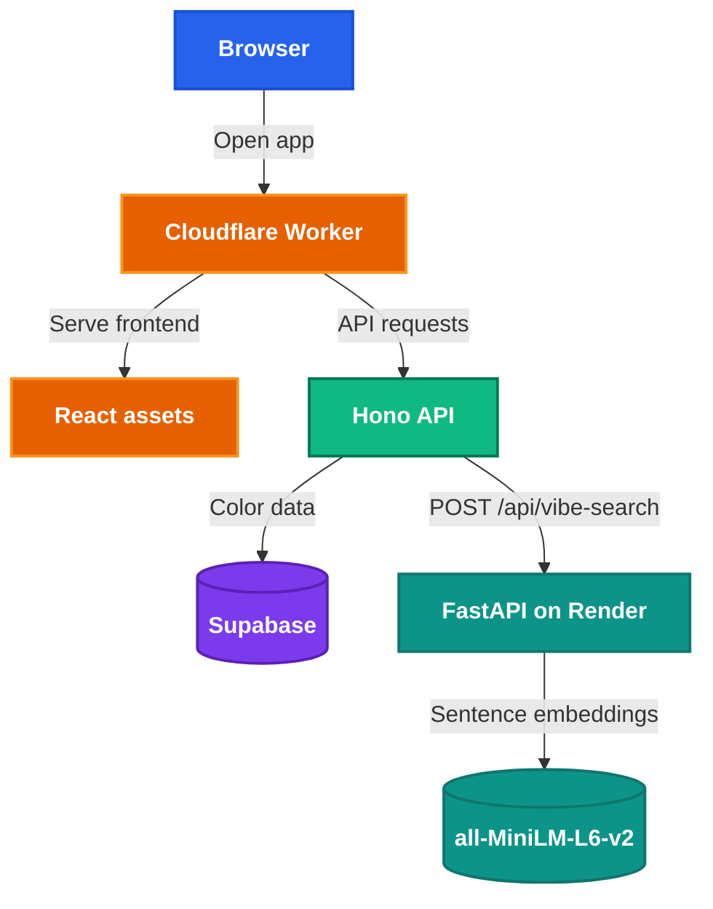

<h1 style="view-transition-name: deck-title">End to End Deployment</h1>

Part 2: Automating your deployment

---
src: ./part-1/presenter-introduction.md
---

---
layout: section
---

## Welcome back!

What we covered in Part 1:

- Deploying a web application from localhost to the internet
- Serverless deployment on Cloudflare Workers
- Connecting Supabase for database and file storage
        
<!-- Putt: Testing, CI/CD -->


<!-- Tien Cheng: Containers, Monitoring -->

---
layout: section
---

## Containers

---
layout: default
class: compact
---

# It works on my machine?

<WorksOnMyMachineFlow />

<!--
An application needs to run reliably across different computing environments, from developer’s laptop to production server.

Walk through the clicks: your laptop, git push, teammate's machine breaks, production breaks.
No bullet list on this slide — let the terminals tell it. Pause on the last error before moving on.

[~2 min]
-->


---
layout: two-cols-header
---

# Containers

::left::

- Package code, runtime, OS libraries, and large assets into **one image**
- If it runs in the image on your laptop, it should run the same way in production

::right::


<!--
Callback to the docker meme from Part 1. This is the packaging format we deferred last session.

[~1.5 min]
-->

---
layout: two-cols-header
---

# Why containers?  
Serverless is great until the runtime boundary becomes the problem

::left::

## Cloudflare Worker

- Tiny deploy artifact
- Platform handles scaling and backend ops
- Pay only when code runs
- Local testing may not match production perfectly

::right::

## Container

- Packages app + runtime + system dependencies
- Runs like a normal Linux service
- More control over languages, libraries, and memory
- Easier to test locally: same image runs in prod

<!--
Based on Cloudflare's serverless vs containers comparison:
- serverless scales automatically, has less maintenance, and charges for actual runtime
- containers give more control over the runtime environment and dependencies, but come with more maintenance
- testing serverless can be harder because the backend environment is harder to replicate locally; containers are easier to test before production because the same image runs everywhere
- hybrid architectures make sense when one part of the app needs more memory, bigger files, or long-running work
Use this slide to frame containers as an escape hatch for the AI microservice, not as "serverless bad".

[~2 min]
-->

---
---

# Every app needs AI now right?
- Let's add some AYY EYE features to Color Swipe
- Vibe Search: type in a sentence and we find the color that vibes best with your text
- Because we're RESUMEMAXXING, we're going to implement this feature with a Python Microservice that calls a self hosted model
- Can we just do it on Workers?

<svg class="workers-limits-meme-filters" aria-hidden="true" width="0" height="0">
  <defs>
    <filter id="workers-meme-knockout" color-interpolation-filters="sRGB">
      <feColorMatrix
        in="SourceGraphic"
        type="matrix"
        values="1 0 0 0 0  0 1 0 0 0  0 0 1 0 0  -1.1 -1.1 -1.1 3.2 0"
      />
    </filter>
  </defs>
</svg>

<div
  class="workers-limits-meme"
  role="img"
  aria-label="Cloudflare Workers limits with reaction over 128 MB memory limit"
>
  
  <div class="workers-limits-meme__sticker" aria-hidden="true">
    
  </div>
</div>

---
class: diagram-heavy compact
---

# But fr tho, what are we actually going to build?

<div class="flex justify-center mt-4">



</div>

---
layout: section
---

## Docker

---
---

# The Docker Ecosystem

<!-- todo: make this side bigger -->
<DockerStack />

<!--
Walk through the stack top to bottom with clicks.

"Docker" in industry usually means this whole ecosystem, not just Docker Desktop.
Each layer is swappable. Desktop app vs OrbStack, Engine vs Podman, but the CLI and image format stay the same.

[~2 min]
-->

---
---

# For this workshop

- You installed **Docker Desktop** or **OrbStack**. Either gives you a working `docker` command.
- Every command in this session works the same on both.
- **Docker Hub** and **GHCR** are image registries: like npm, but for container images.

<!--
If someone asks "do I need Docker Desktop specifically?" the answer is no.
They need a runtime that responds to `docker run`. Desktop and OrbStack both bundle that on Mac.

[~30 sec]
-->

---
---

# What is Docker?

- **Docker** is a tool for building and running containers
- **Image** = a snapshot of a filesystem + metadata (like a class)
- **Container** = a running instance of an image (like an object)
- Each instruction in a Dockerfile creates a **layer**
- Layers are cached and reused across builds

---
---

# Verify Docker is installed

```bash
docker run hello-world
```

This pulls an image from Docker Hub, creates a container, runs it, prints output, and exits.

<Terminal class="max-h-1/2" session="docker-basics" persist />

<!-- Pre-workshop setup should have had students install Docker Desktop or OrbStack -->
<!--
Demo script:

docker run hello-world
docker image ls hello-world
docker ps -a --filter ancestor=hello-world

Expected output:
- The terminal prints "Hello from Docker!"
- `docker image ls hello-world` shows the pulled image.
- `docker ps -a` shows an exited container from that image.
-->

---
---

# Run an interactive container

```bash
docker run -it python:3.12-slim-trixie bash
```

You're now inside a Linux environment with Python installed.


When you exit, the container stops. Any files you created are gone.

Containers are **ephemeral** by default.
<Terminal class="max-h-1/2" session="docker-basics" persist />
<!--
We can run commands like
python --version
pip list
ls /
exit
 -->

---
---

# How to train your Dockerfile
- A Dockerfile provides instructions on how to build an image
- Format: `INSTRUCTION arguments`
- All images must build on top of a base image, defined by a `FROM image` instruction
- In general, each command generates a cached read-only layer


---
---
# Our Dockerfile

```dockerfile {class: '!children:text-xl'}
FROM ghcr.io/astral-sh/uv:python3.12-trixie-slim

WORKDIR /app

COPY pyproject.toml uv.lock ./
RUN uv sync --frozen --no-dev

COPY . .

EXPOSE 8000
CMD ["uv", "run", "uvicorn", "main:app", "--host", "0.0.0.0", "--port", "8000"]
```

---
---

<CheckpointBadge />

# Build and run

```bash
# Inside part-2/apps/vibe-search
docker build -t color-vibe-search .
docker run -p 8000:8000 color-vibe-search
```

Open `http://localhost:8000/docs` in your browser.

Test it:

```bash
curl -X POST http://localhost:8000/api/vibe-search \
  -H "Content-Type: application/json" \
  -d '{"query": "ocean breeze"}'
```

---
layout: default
class: live-terminal-slide
---

<div class="live-terminal--full">
<Terminal session="vibe-service" persist />
</div>


<!-- Checkpoint:

- FastAPI docs page loads
- POST returns ranked color results
- First response is slow while the model downloads -->

---
---

# Optimising Cold Starts

- The container started quickly, but the app was not fully ready for inference
- FastAPI can serve `/docs` before the model exists on disk
- Lazy loading means the first inference pays the model download cost
- Later requests are faster only if the same container cache survives

---
---

# Where should the model live?

| Option | Good for | Tradeoff |
| --- | --- | --- |
| Runtime download | Small images, simple local dev | Slow first request |
| Image layer | Predictable demos and deploys | Bigger image |
| Persistent volume/cache | Larger models on stable hosts | Needs platform support |
| Just call an API bro | Very large models, shared infra | Network and ops complexity |

<!-- For this workshop, `all-MiniLM-L6-v2` is small enough that baking it into the image is a reasonable tradeoff. -->

---
---

# One option: pre-load the model

`scripts/preload_model.py`:

```python
from sentence_transformers import SentenceTransformer

model = SentenceTransformer("all-MiniLM-L6-v2")
print(f"✓ Loaded model ({model.get_sentence_embedding_dimension()}d embeddings)")
```

This shifts the download from the first request to `docker build`.

The first request becomes predictable, but the image gets larger because the model files are now part of the image.

---
---

# Improved Dockerfile

```dockerfile 
FROM ghcr.io/astral-sh/uv:python3.12-trixie-slim

WORKDIR /app

# Install dependencies first
COPY pyproject.toml uv.lock ./
RUN uv sync --frozen --no-dev

# Pre-load model at build time
COPY scripts/preload_model.py ./scripts/
RUN uv run python scripts/preload_model.py

# Copy application code last (changes most often)
COPY . .

EXPOSE 8000
CMD ["uv", "run", "uvicorn", "main:app", "--host", "0.0.0.0", "--port", "8000"]
```

---
---

# Why this order matters

Docker caches layers top-to-bottom. If a layer hasn't changed, Docker skips it.

| Layer | Changes when... | Rebuild cost |
| --- | --- | --- |
| `COPY pyproject.toml uv.lock` | Dependencies change | ~30s (`uv sync`) |
| `RUN uv run python scripts/preload_model.py` | Model changes | ~20s (download) |
| `COPY . .` | Any code change | ~1s (file copy) |

Now the expensive model download happens during the image build. The image is larger, but the first request no longer pays that cost.

If you only changed your Python code, Docker reuses the dependency and model layers. Only the last `COPY` reruns.

**Put things that change rarely at the top. Things that change often at the bottom.**

---
---

<CheckpointBadge />

# Let's try

```bash
docker build -t color-vibe-search .
docker run -p 8000:8000 color-vibe-search
```

Open `http://localhost:8000/docs` in your browser.

Test it:

```bash
curl -X POST http://localhost:8000/api/vibe-search \
  -H "Content-Type: application/json" \
  -d '{"query": "ocean breeze"}'
```

<!-- Checkpoint:

- FastAPI docs page loads
- POST returns ranked color results
- First response is fast because this image already contains the model -->

---
layout: default
class: live-terminal-slide
---

<div class="live-terminal--full">
<Terminal session="vibe-service" persist />
</div>

<!--
Demo script:

cd ../vibe-search
docker build -t color-vibe-search .
docker run -p 8000:8000 color-vibe-search

In another terminal or after restarting the slide terminal session:

curl -X POST http://localhost:8000/api/vibe-search \
  -H "Content-Type: application/json" \
  -d '{"query": "ocean breeze"}'

Expected output:
- `docker build` completes and tags `color-vibe-search`.
- `docker run` starts Uvicorn on `0.0.0.0:8000`.
- `/docs` loads in the browser.
- The curl response returns ranked color results quickly on the first request because the image already contains the model.

If the build is slow, keep the static command slide visible, explain that PyTorch and model layers are the expensive part, and remind students that large production models often belong in a volume, cache, or external model service instead.
-->

---
---

---
class: diagram-heavy compact container-vs-vm-slide
---

# How containers actually work

<ContainerVsVm />

<!-- - **VM**: each app carries its own full operating system (Guest OS per VM).
- **Container**: apps share the host's OS kernel through Docker. No Guest OS per app. -->

| | VM | Container |
| --- | --- | --- |
| Startup time | Minutes | Milliseconds |
| Size | GBs | MBs to low GBs |

<!--
Point at the diagram: six apps on one Host OS vs three VMs each with their own Guest OS.
Containers are not VMs. They share the host kernel.

[~1.5 min]
-->

---
---

# Containers underneath the hood

- **What it can see**: a container only sees its own processes and files, not yours or another container's.
- **What it can use**: the OS caps each container's CPU and memory, so one container can't starve the rest.
- **Its files**: the image is read-only. Writes go to a thin throwaway layer on top, discarded when the container stops.

Containers are natively a **Linux** feature. Docker on macOS and Windows runs a small hidden Linux VM in the background.


<!--
Technically Windows can run containers using HyperV
Orbstack uses Docker Engine but provides an optimised Linux VM to run images faster
For the curious: visibility = namespaces, resource caps = cgroups, layered files = OverlayFS.
This ties into the platform quirks appendix.

[~1.5 min]
-->

---
layout: section
class: media-heavy
---

## Ship it


---
---
# Render
- Render is a platform as a service that allows us to deploy and host applications, including containers
- Why Render?
  - A somewhat reasonable free tier (for now...)
  - Decent developer experience
- Alternatives:
  - Google Cloud Run (offers $300 in free credit but can be a pain to setup), AWS Fargate
  - Cloudflare Containers only available with paid plan :(


---
---

# Where images live

- A container registry stores Docker images, like npm stores packages
- Docker Hub and GHCR are common public registries
- Registries matter when a platform needs to pull a prebuilt image

For this workshop, Render builds the image from your GitHub repo's Dockerfile.

---
---

<CheckpointBadge />

# Deploy to Render

1. Go to [render.com](https://render.com) → **New** → **Web Service**
2. Connect your GitHub repo
3. Set **Language** to **Docker**
4. Set **Root Directory** to `part-2/apps/vibe-search`
5. Instance type: **Free**
6. Deploy

Render builds the image from the Dockerfile in your repo and redeploys when you push changes.

<!--
Walk through the Render dashboard live. Build takes a few minutes because of PyTorch.
If the repo layout differs, use Render's Dockerfile path setting instead of Root Directory.

Checkpoint:

- Render gives you a public URL
- `https://<your-service>.onrender.com/docs` loads the FastAPI Swagger UI
- POST `/api/vibe-search` returns results
-->


---
---

# Connect to color-swipe

Add the Render URL and an internal API key as Cloudflare Worker secrets:

```bash
node -e "console.log(require('crypto').randomBytes(32).toString('hex'))"
# copy this value for Render and Cloudflare

pnpm wrangler secret put VIBE_SEARCH_URL
# paste: https://<your-service>.onrender.com

pnpm wrangler secret put VIBE_SEARCH_API_KEY
# paste the generated value
```

Add a proxy route in `src/worker.ts`:

```ts
app.post("/api/vibe-search", async (c) => {
  const body = await c.req.json();
  const res = await fetch(`${c.env.VIBE_SEARCH_URL}/api/vibe-search`, {
    method: "POST",
    headers: {
      "Content-Type": "application/json",
      "X-Internal-Api-Key": c.env.VIBE_SEARCH_API_KEY,
    },
    body: JSON.stringify(body),
  });
  if (!res.ok) return c.json({ error: "Search service unavailable" }, 502);
  return c.json(await res.json());
});
```

---
---


<CheckpointBadge />

# Let's redeploy color-swipe

```bash
pnpm run deploy
```

The browser never talks to Render directly. The Worker acts as a proxy.

<!-- Render free tier spins down after 15 min of inactivity. First request after spindown takes ~30s. This is a container cold start — compare with Workers' near-zero cold starts. -->

---
---
# How to not get hacked

- Problem: `vibe-search` is still public if someone knows the Render URL
- Consequence (worse case): api bills go brrr
Good options:

- **Private networking**: backend + `vibe-search` on the same private network
- **API Gateway**: put a gateway in front for auth, rate limits, logging, and routing
- **Internal API key**: Worker sends a secret header; FastAPI rejects missing/wrong keys
- **Rate limits + input limits**: cap request size, prompt length, timeout, and calls/user
- **Do not rely on CORS**: CORS does not stop direct `curl`


---
---

# It's lockdown time

Add the same secret in Render:

```txt
Render dashboard → Environment → Add Environment Variable

VIBE_SEARCH_API_KEY=<generated value>
```

Then verify it in FastAPI:

```py
import os
from fastapi import Depends, Header, HTTPException

VIBE_SEARCH_API_KEY = os.environ["VIBE_SEARCH_API_KEY"]

def require_internal_api_key(
    x_internal_api_key: str | None = Header(default=None),
):
    if x_internal_api_key != VIBE_SEARCH_API_KEY:
        raise HTTPException(status_code=401, detail="Invalid API key")

@app.post("/api/vibe-search", dependencies=[Depends(require_internal_api_key)])
def vibe_search(request: VibeSearchRequest):
    ...
```

Save, redeploy `vibe-search`, then redeploy the Worker.

---
---

<CheckpointBadge />

# Hackers begone!

Direct public request should fail:

```bash
curl -X POST https://<your-service>.onrender.com/api/vibe-search \
  -H "Content-Type: application/json" \
  -d '{"query": "ocean breeze"}'
```

---
class: compact stacked-cicd scrollable-code
---

# CI/CD for containers

```yaml {*}{maxHeight:'50vh'}
# .github/workflows/deploy-vibe-search.yml
name: Deploy Vibe Search
on:
  push:
    branches: [main]
    paths: ["vibe-search/**"]

jobs:
  build-and-push:
    runs-on: ubuntu-latest
    permissions:
      contents: read
      packages: write
    steps:
      - uses: actions/checkout@v4
      - uses: docker/login-action@v3
        with:
          registry: ghcr.io
          username: ${{ github.actor }}
          password: ${{ secrets.GITHUB_TOKEN }}
      - uses: docker/build-push-action@v6
        with:
          context: ./vibe-search
          push: true
          tags: ghcr.io/${{ github.repository_owner }}/color-vibe-search:latest
```


---
layout: section
---

## Docker Compose

---
---

# The problem

In your local dev environment, you now have two services running locally:

- `pnpm dev` for the Worker
- `docker run` for the FastAPI container

What if you had 5 services? A database? A cache?

Docker Compose lets you define and run multiple containers with one command.

<!-- **Compose is a local development tool, not a production deployment tool.**

In production, each service runs on its own platform (Workers, Render, Supabase). Locally, you want one command to start everything. -->

---
---

# `docker-compose.yml`

```yaml
services:
  vibe-search:
    build: ./vibe-search
    ports:
      - "8000:8000"

  postgres:
    image: postgres:16
    ports:
      - "5432:5432"
    environment:
      POSTGRES_DB: colorswipe
      POSTGRES_PASSWORD: localdev
    volumes:
      - pgdata:/var/lib/postgresql/data

volumes:
  pgdata:
```

---
---

# What Compose gives you

- **`build: ./vibe-search`**: builds the Dockerfile for you
- **`image: postgres:16`**: pulls a pre-built image (this is what Supabase runs under the hood)
- **`volumes`**: named volumes persist data across container restarts
- **Networking**: services in the same Compose file can reach each other by name (`postgres:5432`)

---
layout: default
class: compact live-terminal-slide
---

# `docker compose up`
<CheckpointBadge />

<div class="live-terminal--full">
<Terminal session="compose" persist />
</div>

<!--
Demo script:

docker compose up

In another terminal:

docker compose exec postgres psql -U postgres -d colorswipe
\dt
\q

Expected output:
- Compose starts both services from one file.
- The `vibe-search` service logs show the FastAPI app starting.
- The `postgres` service is reachable by Compose service name.
- The named volume keeps data after `docker compose down` and `docker compose up`.

If Compose fails because files are not ready on a student's machine, use the static YAML slide to explain the mental model: one file declares services, ports, environment variables, volumes, and local networking.
-->

---
---

# When to use Compose

| Scenario | Tool |
| --- | --- |
| Local development | Docker Compose |
| Side project on a single VPS | Compose is fine |
| Production at scale | Managed services (Render, Supabase) or orchestrators (K8s) |

Compose mirrors production's **shape** (same services, same communication) but not its **infrastructure**.

---
layout: section
---

## Monitoring and Telemetry

---
layout: two-cols-header
---

# Deploying is half the battle

::left::


::right::

What happens when you discover a bug in production?

- Logs exist (`wrangler tail`, Render logs) but you have to be looking at them.
- Monitoring and telemetry tools help us to trace what's happening within the application when things go wrong:
  - Sentry
  - PostHog
- For LLM applications: Langfuse

---
---
# Sentry

**Sentry** captures errors automatically and notifies you. 

- Full stack traces with context
- Which request caused the error
- How often it's happening
- Performance data (slow endpoints, slow queries)


---
---

# Set up Sentry for FastAPI

```bash
uv add sentry-sdk
```

```python
import sentry_sdk
from fastapi import FastAPI

sentry_sdk.init(
    dsn=os.environ["SENTRY_DSN"],
    traces_sample_rate=1.0,  # 100% in dev, lower in production
)

app = FastAPI()
```

The SDK auto-detects FastAPI. Unhandled exceptions are captured and sent to Sentry with the full request context.

Add `SENTRY_DSN` to your Render environment variables (same way you'd add any other secret).

---
---

# Set up Sentry for Cloudflare Workers

```bash
pnpm add @sentry/cloudflare
```

Add to `wrangler.jsonc`:

```jsonc
{
  "compatibility_flags": ["nodejs_compat"]
}
```

Wrap your worker entry point:

```ts
import * as Sentry from "@sentry/cloudflare";

export default Sentry.withSentry(
  (env) => ({ dsn: env.SENTRY_DSN }),
  {
    async fetch(request, env, ctx) {
      return app.fetch(request, env, ctx);
    },
  } satisfies ExportedHandler<Env>
);
```

---
---

# Set up Sentry for Cloudflare Workers

Set `SENTRY_DSN` as a Cloudflare secret:

```bash
pnpm wrangler secret put SENTRY_DSN
```

Then redeploy the Worker:

```bash
pnpm run deploy
```

Once the deploy finishes, Worker errors can appear in the same Sentry project as your FastAPI errors.

---
---

# Test it

Add a route that deliberately throws:

```python
@app.get("/api/debug-sentry")
def trigger_error():
    raise ValueError("Testing Sentry integration")
```

Hit the endpoint. Within seconds, the error shows up in your Sentry dashboard with:

- The full stack trace
- The request URL, method, and headers
- The Python/Node version and environment

---
---

# What you see in Sentry

| Feature | What it tells you |
| --- | --- |
| **Issues** | Grouped errors with frequency, first/last seen |
| **Stack traces** | Exact line of code that failed |
| **Breadcrumbs** | What happened before the error (HTTP requests, logs) |
| **Performance** | Slowest endpoints, p95 response times |
| **Alerts** | Email or Slack notification when error rate spikes |

---
---

# What you built

<div class="grid grid-cols-2 gap-8 mt-6">
<div>

## Part 1

- React frontend on Workers
- Hono API on Workers
- Supabase Postgres + Storage
- Manual deploy with Wrangler

</div>
<div>

## Part 2

- CI/CD with GitHub Actions
- Containerized Python microservice
- Deployed to Render
- Service-to-service communication
- Docker Compose for local dev
- Error monitoring with Sentry

</div>
</div>

---
layout: quote
---

# Ship the smallest real thing first.

Then make shipping boring.

---
layout: center
class: text-center
---

# How did Part 2 go?

Your feedback helps us improve future sessions.

<!-- TODO: Add feedback QR code and link -->

---
layout: section
---

## Appendix
Time killing time
---
---

# Appendix: Infrastructure as Code

Everything we clicked through today (Supabase project, Render service, Cloudflare Worker) could be defined in code.

- **Terraform / OpenTofu**: declare infrastructure in `.tf` files, `terraform apply` creates it
- **GitOps**: infrastructure config lives in your repo, changes go through PRs


---
---

# Appendix: Docker platform quirks

- Containers are a **Linux kernel feature**
- macOS / Windows: Docker Desktop and OrbStack both run a lightweight Linux VM under the hood
- **Podman** is a drop-in Engine alternative (daemonless, rootless). Same `docker` CLI, different runtime.


---
---

# Appendix: Apple Silicon and cross-platform builds

Your Mac has an ARM CPU. Render runs x86 (amd64).

If you build locally and push, the image might not run on Render.

```bash
# Build for a specific platform
docker build --platform linux/amd64 -t myapp .

# Or build for multiple platforms
docker buildx build --platform linux/amd64,linux/arm64 -t myapp .
```

The `--platform` flag tells Docker which CPU architecture to target. Without it, Docker builds for your host architecture.


---
---

# Appendix: Docker GPU support

- **NVIDIA**: use NVIDIA Container Toolkit, run with `--gpus all`
- **Mac**: no Metal passthrough (Docker runs in a Linux VM). Use MLX or run natively.
- **Cloud GPUs**: Google Cloud Run, RunPod, Modal, Vast.ai for GPU containers on demand


