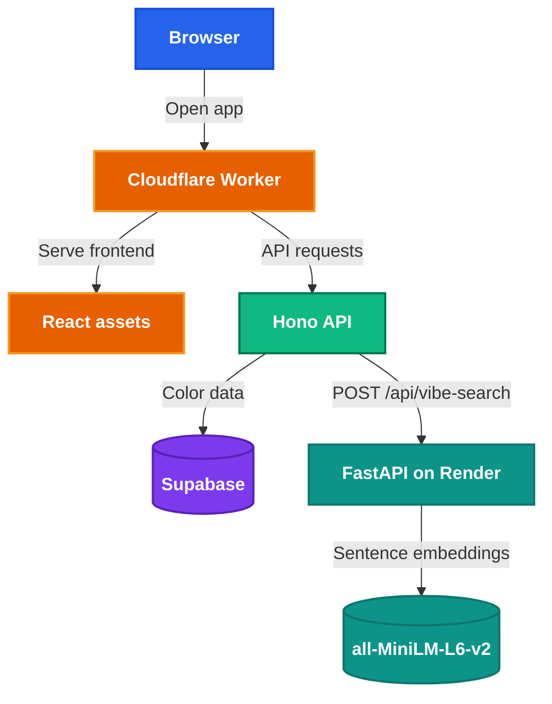

<h1 style="view-transition-name: deck-title">End to End Deployment</h1>

Part 2: Automating your deployment

---
src: ./part-1/presenter-introduction.md
---

---
layout: section
---

## Welcome back!

What we covered in Part 1:

- Deploying a web application from localhost to the internet
- Serverless deployment on Cloudflare Workers
- Connecting Supabase for database and file storage
        
<!-- Putt: Testing, CI/CD -->


<!-- Tien Cheng: Containers, Monitoring -->

---
layout: section
---

## Today

- Testing: make sure your app actually works
- CI/CD: automate testing and deployment
- Containers: package apps that run anywhere
- Monitoring: know when things break

<!--
Here's the roadmap for today. We'll cover four topics, each with a concept section followed by hands-on.

First, testing — we'll write tests for the Color Swipe app you deployed in Part 1. Then CI/CD — we'll automate running those tests and deploying every time you push code. After that, containers — we'll package a Python microservice with Docker. And finally, monitoring — we'll set up Sentry to catch errors in production.

Let's start with testing.

[~1 min]
-->

---
layout: section
---

## Testing

---
---

# Why test?

<div class="grid grid-cols-2 gap-8 mt-8">
<div>

## Without tests

- You change something and break a different feature
- You only find bugs when users report them
- Refactoring feels dangerous
- Deploying feels scary

</div>
<div>

## With tests

- You change something and tests tell you if it broke
- You catch bugs before they reach production
- Refactoring is safe: tests are your safety net
- Deploying is boring: tests already passed

</div>
</div>

<!--
Why do we write tests? Because manually checking your app every time you change something doesn't scale.

Without tests, every change is a gamble. You fix a bug in the voting logic but accidentally break the results page. You don't find out until a user reports it. And every time you refactor, you hold your breath.

With tests, you run a command and get instant feedback. Green means good. Red means something broke. You can refactor confidently because the tests tell you exactly what changed.

For a student project, this might feel like overkill. But the earlier you build the habit, the less time you spend debugging at 2 AM before your demo.

[~2 min]
-->

---
class: compact
---

# The testing pyramid

<div class="mt-6 flex flex-col items-center gap-2">
  <div v-click class="w-48 rounded-t-lg border border-[var(--nus-border)] bg-[color-mix(in_srgb,var(--nus-accent),transparent_85%)] px-4 py-3 text-center shadow-[var(--nus-shadow)]">
    <div class="font-bold text-[var(--nus-accent)]">E2E tests</div>
    <div class="nus-token-faint mt-1 text-[0.72rem]">Few · Slow · Real browser</div>
  </div>
  <div v-click class="w-72 border border-[var(--nus-border)] bg-[color-mix(in_srgb,var(--nus-success),transparent_88%)] px-4 py-3 text-center shadow-[var(--nus-shadow)]">
    <div class="font-bold text-[var(--nus-success)]">Integration tests</div>
    <div class="nus-token-faint mt-1 text-[0.72rem]">Some · Medium speed · Multiple pieces together</div>
  </div>
  <div v-click class="w-96 rounded-b-lg border border-[var(--nus-border)] bg-[var(--nus-surface)] px-4 py-3 text-center shadow-[var(--nus-shadow)]">
    <div class="font-bold text-[var(--nus-text)]">Unit tests</div>
    <div class="nus-token-faint mt-1 text-[0.72rem]">Many · Fast · One function at a time</div>
  </div>
</div>

<!--
The testing pyramid is a mental model for how many of each type of test to write.

At the bottom: unit tests. These test one function or one module in isolation. They're fast, there are lots of them, and they're cheap to write. Example: does imageUrl("red.svg") return "/api/images/red.svg"?

In the middle: integration tests. These test multiple pieces working together. Example: does the Hono API route actually query Supabase and return the right data?

At the top: end-to-end tests. These test the entire app from the user's perspective using a real browser. They're slow, expensive, and brittle — but they catch real user-facing bugs. Example: does the Color Swipe app load, show cards, and let you swipe?

The pyramid shape tells you the ratio: lots of unit tests, some integration tests, a few E2E tests.

For today's workshop, we'll write one or two of each to give you a feel for all three layers.

[~2 min]
-->

---
---

# Vitest

- A testing framework built for **Vite** projects
- Runs your TypeScript code directly — no separate build step
- Fast: uses Vite's module resolution and caching
- API is compatible with Jest (`describe`, `it`, `expect`, `vi.mock`)

```bash
pnpm test          # run all tests once
pnpm test:watch    # re-run on file changes
```

<!--
We're using Vitest because our app already uses Vite. Vitest plugs directly into Vite's module system, so it understands TypeScript, JSX, and all the imports your app uses — no extra configuration needed.

The API is almost identical to Jest, which is the most popular JavaScript testing framework. If you've seen Jest before, Vitest will feel familiar. If you haven't, don't worry — the API is simple: describe groups your tests, it defines individual test cases, and expect makes assertions.

Let's write some tests.

[~1 min]
-->

---
---

<CheckpointBadge />

# Write API unit tests

Open `tests/api/worker.test.ts` and follow along.

We test the Hono API routes using `app.request()` — no server needed:

```ts
import { describe, expect, it, vi } from "vitest";
import app from "../../src/worker";

vi.mock("@supabase/supabase-js", () => ({
  createClient: vi.fn(() => ({
    from: vi.fn(() => ({
      select: vi.fn().mockReturnValue({
        order: vi.fn().mockResolvedValue({ data: [], error: null }),
      }),
    })),
  })),
}));

describe("GET /api/health", () => {
  it("returns ok status and service name", async () => {
    const res = await app.request("/api/health");
    expect(res.status).toBe(200);
    expect(await res.json()).toEqual({ ok: true, service: "color-swipe" });
  });
});
```

Run the tests:

```bash
pnpm test
```

<!--
Walk through the test file line by line.

app.request() is Hono's built-in test helper. It simulates an HTTP request and returns a Response object — exactly like a real fetch call, but without starting a server.

vi.mock() replaces the Supabase client with a mock. This is critical — we don't want tests hitting a real database. The mock returns empty data, which is fine for testing the route logic.

The describe/it/expect pattern is standard across most testing frameworks. describe groups related tests, it defines a single test case, and expect makes assertions about the result.

Have students run pnpm test and verify all tests pass.

[~5 min, students write and run tests]
-->

---
---

<CheckpointBadge />

# Write client tests

Open `tests/client/api.test.ts`.

These test the API helper functions that React components use:

```ts
import { describe, expect, it } from "vitest";
import { imageUrl } from "../../src/lib/api";

describe("imageUrl", () => {
  it("returns the correct API path for a given key", () => {
    expect(imageUrl("red.svg")).toBe("/api/images/red.svg");
  });

  it("handles keys with subdirectories", () => {
    expect(imageUrl("colors/blue.svg")).toBe("/api/images/colors/blue.svg");
  });
});
```

Run all tests:

```bash
pnpm test
```

Checkpoint:

- All 5 tests pass (3 API + 2 client)

<!--
Client tests are the simplest tests to write. They test pure functions — no mocking, no async, no server.

imageUrl is a pure function: given an input, it always returns the same output. These are the easiest things to test and the most valuable — they catch regressions when someone changes a URL pattern.

Have students run pnpm test and verify all 5 tests pass.

[~3 min, students write and run tests]
-->

---
---

# Playwright

- An **end-to-end** testing framework that runs real browsers
- Simulates user interactions: clicks, typing, navigation, drag gestures
- Catches bugs that unit tests miss: rendering issues, broken layouts, real user flows

```bash
pnpm exec playwright install --with-deps chromium
pnpm test:e2e
```

<!--
Playwright is different from Vitest. Instead of testing functions in isolation, it opens a real browser, navigates to your app, and interacts with it like a real user.

It can click buttons, type text, scroll pages, and even simulate drag gestures — which is exactly what we need for the swipe cards in Color Swipe.

Playwright automatically starts your dev server before running tests (configured in playwright.config.ts), so you don't need to manually start pnpm dev in another terminal.

For today, we'll write one smoke test: load the page, verify a color card appears, and swipe once.

[~1.5 min]
-->

---
---

<CheckpointBadge />

# Write E2E smoke test

Open `tests/e2e/smoke.test.ts`:

```ts
import { test, expect } from "@playwright/test";

test("smoke test: load page, verify color card, swipe once", async ({ page }) => {
  await page.goto("/");
  await page.waitForSelector('[class*="swipe"]', { timeout: 10_000 });

  const card = page.locator('[class*="swipe-card"]').first();
  await expect(card).toBeVisible();

  const box = await card.boundingBox();
  if (!box) throw new Error("Card not found");

  await page.mouse.move(box.x + box.width / 2, box.y + box.height / 2);
  await page.mouse.down();
  await page.mouse.move(box.x + box.width + 300, box.y + box.height / 2, { steps: 10 });
  await page.mouse.up();
});
```

Install browsers and run:

```bash
pnpm exec playwright install --with-deps chromium
pnpm test:e2e
```

<!--
Walk through the test:

1. page.goto("/") opens the app
2. waitForSelector waits for the swipe UI to render
3. locator finds the first swipe card
4. boundingBox gets the card's position and size
5. The mouse.move/down/move/up sequence simulates a drag gesture to the right — a "like" swipe

The webServer config in playwright.config.ts automatically starts pnpm dev before the test runs.

Have students install Playwright browsers and run the E2E test. The browser will open and they'll see the card swipe automatically.

[~5 min, students install browsers and run E2E]
-->

---
layout: section
---

## CI/CD

---
---

# Right now, deploying looks like this

<div class="mt-8 flex flex-col items-center gap-3 text-[0.88rem]">
  <div v-click class="w-80 rounded-lg border border-[var(--nus-border)] bg-[var(--nus-surface)] px-4 py-3 text-center shadow-[var(--nus-shadow)]">
    <span class="font-bold">1.</span> You finish coding
  </div>
  <div v-click class="nus-token-accent text-xl font-bold">&darr;</div>
  <div v-click class="w-80 rounded-lg border border-[var(--nus-border)] bg-[var(--nus-surface)] px-4 py-3 text-center shadow-[var(--nus-shadow)]">
    <span class="font-bold">2.</span> You remember to run tests <span class="nus-token-faint">(maybe)</span>
  </div>
  <div v-click class="nus-token-accent text-xl font-bold">&darr;</div>
  <div v-click class="w-80 rounded-lg border border-[var(--nus-border)] bg-[var(--nus-surface)] px-4 py-3 text-center shadow-[var(--nus-shadow)]">
    <span class="font-bold">3.</span> You run <code class="text-[var(--nus-accent)]">pnpm deploy</code> manually
  </div>
  <div v-click class="nus-token-accent text-xl font-bold">&darr;</div>
  <div v-click class="w-80 rounded-lg border border-[var(--nus-border)] bg-[color-mix(in_srgb,var(--nus-warning),transparent_88%)] px-4 py-3 text-center shadow-[var(--nus-shadow)]">
    <span class="font-bold text-[var(--nus-warning)]">4.</span> <span class="text-[var(--nus-warning)]">You forget step 2 or 3 at some point</span>
  </div>
</div>

<!--
In Part 1, you deployed manually. You ran pnpm deploy from your terminal, and Wrangler uploaded your app to Cloudflare.

That works fine for a single developer. But what happens when you have a team? What if someone pushes broken code? What if you forget to test before deploying? What if you're sick and your teammate needs to deploy but doesn't know the steps?

Manual deploys are fragile. They rely on you remembering every step, every time. And humans are bad at remembering things.

The solution: let a machine do it. Every time you push code, a machine runs the tests and deploys for you. That's CI/CD.

[~2 min]
-->

---
---

# What is CI?

**Continuous Integration**: automatically test your code every time you change it.

<div class="mt-6 grid grid-cols-[1fr_auto_1fr_auto_1fr] items-center gap-3 text-center text-[0.82rem]">
  <div v-click class="rounded-lg border border-[var(--nus-border)] bg-[var(--nus-surface)] p-3 shadow-[var(--nus-shadow)]">
    <div class="font-bold">You push code</div>
    <div class="nus-token-faint mt-1">git push</div>
  </div>
  <div v-click class="nus-token-accent text-2xl font-bold">&rarr;</div>
  <div v-click class="rounded-lg border border-[var(--nus-border)] bg-[color-mix(in_srgb,var(--nus-success),transparent_88%)] p-3 shadow-[var(--nus-shadow)]">
    <div class="font-bold text-[var(--nus-success)]">Tests run automatically</div>
    <div class="nus-token-faint mt-1">unit + client + E2E</div>
  </div>
  <div v-click class="nus-token-accent text-2xl font-bold">&rarr;</div>
  <div v-click class="rounded-lg border border-[var(--nus-border)] bg-[var(--nus-surface)] p-3 shadow-[var(--nus-shadow)]">
    <div class="font-bold">You see results</div>
    <div class="nus-token-faint mt-1">pass or fail</div>
  </div>
</div>

<v-clicks>

## Why it matters

- You never forget to run tests — the machine doesn't forget
- Broken code is caught immediately, not days later
- Your team can see whether the codebase is healthy at a glance

</v-clicks>

<!--
Continuous Integration answers the question: "did my change break anything?"

Every time you push code to GitHub, a CI system picks up your code, installs dependencies, and runs your test suite. If all tests pass, you get a green checkmark. If any test fails, you get a red X and the exact error message.

The "continuous" part means it happens on every push — not just when you remember. This catches bugs early, when they're cheap to fix.

For your Orbital project, this means you can push code confidently at 1 AM and know that if something broke, you'll see it immediately — not when your advisor tries the demo next week.

[~2 min]
-->

---
---

# What is CD?

**Continuous Deployment**: automatically deploy your code every time tests pass.

<div class="mt-6 grid grid-cols-[1fr_auto_1fr_auto_1fr_auto_1fr] items-center gap-3 text-center text-[0.82rem]">
  <div v-click class="rounded-lg border border-[var(--nus-border)] bg-[var(--nus-surface)] p-3 shadow-[var(--nus-shadow)]">
    <div class="font-bold">Push code</div>
  </div>
  <div v-click class="nus-token-accent text-xl font-bold">&rarr;</div>
  <div v-click class="rounded-lg border border-[var(--nus-border)] bg-[color-mix(in_srgb,var(--nus-success),transparent_88%)] p-3 shadow-[var(--nus-shadow)]">
    <div class="font-bold text-[var(--nus-success)]">Tests pass</div>
  </div>
  <div v-click class="nus-token-accent text-xl font-bold">&rarr;</div>
  <div v-click class="rounded-lg border border-[var(--nus-border)] bg-[color-mix(in_srgb,var(--nus-accent),transparent_85%)] p-3 shadow-[var(--nus-shadow)]">
    <div class="font-bold text-[var(--nus-accent)]">Deploy automatically</div>
  </div>
  <div v-click class="nus-token-accent text-xl font-bold">&rarr;</div>
  <div v-click class="rounded-lg border border-[var(--nus-border)] bg-[var(--nus-surface)] p-3 shadow-[var(--nus-shadow)]">
    <div class="font-bold">Live in production</div>
  </div>
</div>

<v-clicks>

## Why it matters

- Deploying becomes boring and predictable
- No one needs to remember the deploy steps
- Your production always matches your latest tested code

</v-clicks>

<!--
Continuous Deployment takes CI one step further. After tests pass, the system automatically deploys your code to production. No human intervention needed.

The "continuous" part means your production app is always up to date with the latest tested code. You push, tests run, code deploys. It's a pipeline.

Some teams use "Continuous Delivery" instead, which means the deploy is one click away but not fully automatic. For student projects, full Continuous Deployment is fine — your production environment is low-stakes.

Together, CI/CD means: push code, tests run, code deploys. You just write code and push. Everything else is automatic.

[~2 min]
-->

---
---

# GitHub Actions

GitHub's built-in CI/CD platform. No extra tools to install.

<div class="mt-6 grid grid-cols-2 gap-4 text-[0.82rem]">
  <div v-click class="rounded-lg border border-[var(--nus-border)] bg-[var(--nus-surface)] p-4 shadow-[var(--nus-shadow)]">
    <div class="font-bold text-[var(--nus-accent)]">Workflow</div>
    <div class="nus-token-faint mt-1">A YAML file in <code>.github/workflows/</code> that defines the entire pipeline</div>
  </div>
  <div v-click class="rounded-lg border border-[var(--nus-border)] bg-[var(--nus-surface)] p-4 shadow-[var(--nus-shadow)]">
    <div class="font-bold text-[var(--nus-accent)]">Job</div>
    <div class="nus-token-faint mt-1">A set of steps that run on a fresh virtual machine (e.g., <code>ubuntu-latest</code>)</div>
  </div>
  <div v-click class="rounded-lg border border-[var(--nus-border)] bg-[var(--nus-surface)] p-4 shadow-[var(--nus-shadow)]">
    <div class="font-bold text-[var(--nus-accent)]">Step</div>
    <div class="nus-token-faint mt-1">A single command or action within a job (e.g., <code>pnpm test</code>)</div>
  </div>
  <div v-click class="rounded-lg border border-[var(--nus-border)] bg-[var(--nus-surface)] p-4 shadow-[var(--nus-shadow)]">
    <div class="font-bold text-[var(--nus-accent)]">Trigger</div>
    <div class="nus-token-faint mt-1">The event that starts the workflow (e.g., <code>push</code>, <code>pull_request</code>)</div>
  </div>
</div>

<!--
GitHub Actions is GitHub's built-in CI/CD platform. You don't need to install anything or sign up for a separate service. It's already available in every GitHub repository.

The core concepts are simple:

A workflow is a YAML file that lives in your repo under .github/workflows/. It defines what happens and when.

A job is a collection of steps that run on a fresh virtual machine. Each job gets its own clean environment — nothing from your laptop, nothing from previous runs.

A step is a single command or action. It could be checking out your code, installing dependencies, running tests, or deploying.

A trigger is the event that starts the workflow. Common triggers: pushing to a branch, opening a pull request, or a scheduled cron job.

Let's look at what a workflow looks like for our Color Swipe app.

[~2 min]
-->

---
class: compact scrollable-code
---

# Our workflow

```yaml
name: Color Swipe CI/CD

on:
  push:
    branches: [main]
  pull_request:
    branches: [main]

jobs:
  test:
    runs-on: ubuntu-latest
    defaults:
      run:
        working-directory: part-2/apps/web
    steps:
      - uses: actions/checkout@v4
      - uses: pnpm/action-setup@v4
        with: { version: 10 }
      - uses: actions/setup-node@v4
        with: { node-version: 22, cache: pnpm }
      - run: pnpm install
      - run: pnpm test
      - run: pnpm exec playwright install --with-deps chromium
      - run: pnpm test:e2e
        env:
          SUPABASE_URL: ${{ secrets.SUPABASE_URL }}
          SUPABASE_KEY: ${{ secrets.SUPABASE_KEY }}

  deploy:
    needs: test
    if: github.ref == 'refs/heads/main'
    runs-on: ubuntu-latest
    defaults:
      run:
        working-directory: part-2/apps/web
    steps:
      - uses: actions/checkout@v4
      - uses: pnpm/action-setup@v4
        with: { version: 10 }
      - uses: actions/setup-node@v4
        with: { node-version: 22, cache: pnpm }
      - run: pnpm install
      - run: pnpm deploy
        env:
          CLOUDFLARE_API_TOKEN: ${{ secrets.CLOUDFLARE_API_TOKEN }}
```

<!--
Let's walk through this workflow line by line.

The trigger: it runs on push to main AND on pull requests targeting main. This means PRs get tested but not deployed. Only pushes to main trigger the deploy.

The test job: it checks out the code, sets up pnpm and Node.js, installs dependencies, runs Vitest, installs Playwright browsers, and runs E2E tests. The Supabase credentials come from GitHub secrets.

The deploy job: it has "needs: test" — meaning it only runs after the test job passes. And "if: github.ref == 'refs/heads/main'" — meaning it only runs on pushes to main, not on PRs. It deploys using pnpm deploy with the Cloudflare API token from secrets.

Notice the working-directory setting. Since our app lives in part-2/apps/web, every command runs from that directory.

[~3 min]
-->

---
---

# Secrets in GitHub Actions

Your workflow needs credentials to deploy. **Never put secrets in code.**

<div class="mt-6 grid grid-cols-2 gap-6 text-[0.82rem]">
<div>

## Where to add them

<v-clicks>

1. Your fork on GitHub
2. **Settings** → **Secrets and variables** → **Actions**
3. **New repository secret**

</v-clicks>

</div>
<div>

## What to add

<v-clicks>

- `CLOUDFLARE_API_TOKEN` — deploy permission
- `SUPABASE_URL` — your project URL
- `SUPABASE_KEY` — your publishable key

</v-clicks>

</div>
</div>

<v-click>

Secrets are accessed as `${{ secrets.SECRET_NAME }}` in the workflow YAML.

</v-click>

<!--
Secrets in GitHub Actions work like wrangler secrets — they're encrypted values that your workflow can access but no one can read.

You add them in your repository settings. Once added, they're available to all workflows as ${{ secrets.SECRET_NAME }}.

For our workflow, we need three secrets: the Cloudflare API token for deploying, and the Supabase URL and key for the E2E tests to work.

The Cloudflare API token is different from what you used with wrangler login. You need to create one in the Cloudflare dashboard with Workers deploy permissions.

[~2 min]
-->

---
---

<CheckpointBadge />

# Fill in the workflow template

Open `.github/workflows/deploy-color-swipe.yml` in your repo.

It has `____` blanks for you to fill in. Use what you just learned:

- **Triggers**: which branches should trigger the workflow?
- **Test steps**: what commands run the tests?
- **Deploy condition**: when should the deploy job run?
- **Deploy step**: what command deploys to Cloudflare?

<!--
Have students open the workflow template and fill in the blanks.

Walk around and help. The answers are:
- branches: [main] for both push and pull_request
- pnpm test for running tests
- pnpm exec playwright install --with-deps chromium for installing browsers
- pnpm test:e2e for running E2E tests
- if: github.ref == 'refs/heads/main' for the deploy condition
- pnpm deploy for the deploy step

[~5 min, students fill in the template]
-->

---
---

<CheckpointBadge />

# Configure secrets

Add three secrets to your GitHub repository:

| Secret name | Where to get it |
|---|---|
| `CLOUDFLARE_API_TOKEN` | [Cloudflare dashboard → API Tokens](https://dash.cloudflare.com/profile/api-tokens) → Edit Cloudflare Workers template |
| `SUPABASE_URL` | Supabase dashboard → Settings → API |
| `SUPABASE_KEY` | Supabase dashboard → Settings → API |

Go to your fork → **Settings** → **Secrets and variables** → **Actions** → **New repository secret**

<!--
Walk students through creating the Cloudflare API token.

The Edit Cloudflare Workers template gives you a token with the right permissions. Copy the token value and add it as a secret in GitHub.

For Supabase, use the same URL and publishable key you used in Part 1.

[~5 min, students configure secrets]
-->

---
---

<CheckpointBadge />

# Push and trigger the pipeline

Commit the completed workflow and push to `main`:

```bash
git add .github/workflows/deploy-color-swipe.yml
git commit -m "ci: add CI/CD pipeline for color-swipe"
git push origin main
```

Then go to your fork on GitHub → **Actions** tab.

Checkpoint:

- The workflow appears in the Actions tab
- The `test` job runs and all tests pass
- The `deploy` job runs and deploys to Cloudflare Workers
- Your app is live at the same `workers.dev` URL from Part 1

<!--
Have students push and watch the pipeline run in the GitHub Actions tab.

The first run might take a few minutes because of pnpm install and Playwright browser installation. Subsequent runs will be faster thanks to caching.

If the deploy fails, check that the CLOUDFLARE_API_TOKEN secret is set correctly. If tests fail, check the logs for the specific error.

[~5 min, students push and verify pipeline]
-->

---
layout: section
---

## Containers

---
layout: default
class: compact
---

# It works on my machine?

<WorksOnMyMachineFlow />

<!--
An application needs to run reliably across different computing environments, from developer’s laptop to production server.

Walk through the clicks: your laptop, git push, teammate's machine breaks, production breaks.
No bullet list on this slide — let the terminals tell it. Pause on the last error before moving on.

[~2 min]
-->


---
layout: two-cols-header
---

# Containers

::left::

- Package code, runtime, OS libraries, and large assets into **one image**
- If it runs in the image on your laptop, it should run the same way in production

::right::


<!--
Callback to the docker meme from Part 1. This is the packaging format we deferred last session.

[~1.5 min]
-->

---
layout: two-cols-header
---

# Why containers?  
Serverless is great until the runtime boundary becomes the problem

::left::

## Cloudflare Worker

- Tiny deploy artifact
- Platform handles scaling and backend ops
- Pay only when code runs
- Local testing may not match production perfectly

::right::

## Container

- Packages app + runtime + system dependencies
- Runs like a normal Linux service
- More control over languages, libraries, and memory
- Easier to test locally: same image runs in prod

<!--
Based on Cloudflare's serverless vs containers comparison:
- serverless scales automatically, has less maintenance, and charges for actual runtime
- containers give more control over the runtime environment and dependencies, but come with more maintenance
- testing serverless can be harder because the backend environment is harder to replicate locally; containers are easier to test before production because the same image runs everywhere
- hybrid architectures make sense when one part of the app needs more memory, bigger files, or long-running work
Use this slide to frame containers as an escape hatch for the AI microservice, not as "serverless bad".

[~2 min]
-->

---
---

# Every app needs AI now right?
- Let's add some AYY EYE features to Color Swipe
- Vibe Search: type in a sentence and we find the color that vibes best with your text
- Because we're RESUMEMAXXING, we're going to implement this feature with a Python Microservice that calls a self hosted model
- Can we just do it on Workers?

<svg class="workers-limits-meme-filters" aria-hidden="true" width="0" height="0">
  <defs>
    <filter id="workers-meme-knockout" color-interpolation-filters="sRGB">
      <feColorMatrix
        in="SourceGraphic"
        type="matrix"
        values="1 0 0 0 0  0 1 0 0 0  0 0 1 0 0  -1.1 -1.1 -1.1 3.2 0"
      />
    </filter>
  </defs>
</svg>

<div
  class="workers-limits-meme"
  role="img"
  aria-label="Cloudflare Workers limits with reaction over 128 MB memory limit"
>
  
  <div class="workers-limits-meme__sticker" aria-hidden="true">
    
  </div>
</div>

---
class: diagram-heavy compact
---

# But fr tho, what are we actually going to build?

<div class="flex justify-center mt-4">



</div>

---
layout: section
---

## Docker

---
---

# The Docker Ecosystem

<!-- todo: make this side bigger -->
<DockerStack />

<!--
Walk through the stack top to bottom with clicks.

"Docker" in industry usually means this whole ecosystem, not just Docker Desktop.
Each layer is swappable. Desktop app vs OrbStack, Engine vs Podman, but the CLI and image format stay the same.

[~2 min]
-->

---
---

# For this workshop

- You installed **Docker Desktop** or **OrbStack**. Either gives you a working `docker` command.
- Every command in this session works the same on both.
- **Docker Hub** and **GHCR** are image registries: like npm, but for container images.

<!--
If someone asks "do I need Docker Desktop specifically?" the answer is no.
They need a runtime that responds to `docker run`. Desktop and OrbStack both bundle that on Mac.

[~30 sec]
-->

---
---

# What is Docker?

- **Docker** is a tool for building and running containers
- **Image** = a snapshot of a filesystem + metadata (like a class)
- **Container** = a running instance of an image (like an object)
- Each instruction in a Dockerfile creates a **layer**
- Layers are cached and reused across builds

---
---

# Verify Docker is installed

```bash
docker run hello-world
```

This pulls an image from Docker Hub, creates a container, runs it, prints output, and exits.

<Terminal class="max-h-1/2" session="docker-basics" persist />

<!-- Pre-workshop setup should have had students install Docker Desktop or OrbStack -->
<!--
Demo script:

docker run hello-world
docker image ls hello-world
docker ps -a --filter ancestor=hello-world

Expected output:
- The terminal prints "Hello from Docker!"
- `docker image ls hello-world` shows the pulled image.
- `docker ps -a` shows an exited container from that image.
-->

---
---

# Run an interactive container

```bash
docker run -it python:3.12-slim-trixie bash
```

You're now inside a Linux environment with Python installed.


When you exit, the container stops. Any files you created are gone.

Containers are **ephemeral** by default.
<Terminal class="max-h-1/2" session="docker-basics" persist />
<!--
We can run commands like
python --version
pip list
ls /
exit
 -->

---
---

# How to train your Dockerfile
- A Dockerfile provides instructions on how to build an image
- Format: `INSTRUCTION arguments`
- All images must build on top of a base image, defined by a `FROM image` instruction
- In general, each command generates a cached read-only layer


---
---
# Our Dockerfile

```dockerfile {class: '!children:text-xl'}
FROM ghcr.io/astral-sh/uv:python3.12-trixie-slim

WORKDIR /app

COPY pyproject.toml uv.lock ./
RUN uv sync --frozen --no-dev

COPY . .

EXPOSE 8000
CMD ["uv", "run", "uvicorn", "main:app", "--host", "0.0.0.0", "--port", "8000"]
```

---
---

<CheckpointBadge />

# Build and run

```bash
# Inside part-2/apps/vibe-search
docker build -t color-vibe-search .
docker run -p 8000:8000 color-vibe-search
```

Open `http://localhost:8000/docs` in your browser.

Test it:

```bash
curl -X POST http://localhost:8000/api/vibe-search \
  -H "Content-Type: application/json" \
  -d '{"query": "ocean breeze"}'
```

---
layout: default
class: live-terminal-slide
---

<div class="live-terminal--full">
<Terminal session="vibe-service" persist />
</div>


<!-- Checkpoint:

- FastAPI docs page loads
- POST returns ranked color results
- First response is slow while the model downloads -->

---
---

# Optimising Cold Starts

- The container started quickly, but the app was not fully ready for inference
- FastAPI can serve `/docs` before the model exists on disk
- Lazy loading means the first inference pays the model download cost
- Later requests are faster only if the same container cache survives

---
---

# Where should the model live?

| Option | Good for | Tradeoff |
| --- | --- | --- |
| Runtime download | Small images, simple local dev | Slow first request |
| Image layer | Predictable demos and deploys | Bigger image |
| Persistent volume/cache | Larger models on stable hosts | Needs platform support |
| Just call an API bro | Very large models, shared infra | Network and ops complexity |

<!-- For this workshop, `all-MiniLM-L6-v2` is small enough that baking it into the image is a reasonable tradeoff. -->

---
---

# One option: pre-load the model

`scripts/preload_model.py`:

```python
from sentence_transformers import SentenceTransformer

model = SentenceTransformer("all-MiniLM-L6-v2")
print(f"✓ Loaded model ({model.get_sentence_embedding_dimension()}d embeddings)")
```

This shifts the download from the first request to `docker build`.

The first request becomes predictable, but the image gets larger because the model files are now part of the image.

---
---

# Improved Dockerfile

```dockerfile 
FROM ghcr.io/astral-sh/uv:python3.12-trixie-slim

WORKDIR /app

# Install dependencies first
COPY pyproject.toml uv.lock ./
RUN uv sync --frozen --no-dev

# Pre-load model at build time
COPY scripts/preload_model.py ./scripts/
RUN uv run python scripts/preload_model.py

# Copy application code last (changes most often)
COPY . .

EXPOSE 8000
CMD ["uv", "run", "uvicorn", "main:app", "--host", "0.0.0.0", "--port", "8000"]
```

---
---

# Why this order matters

Docker caches layers top-to-bottom. If a layer hasn't changed, Docker skips it.

| Layer | Changes when... | Rebuild cost |
| --- | --- | --- |
| `COPY pyproject.toml uv.lock` | Dependencies change | ~30s (`uv sync`) |
| `RUN uv run python scripts/preload_model.py` | Model changes | ~20s (download) |
| `COPY . .` | Any code change | ~1s (file copy) |

Now the expensive model download happens during the image build. The image is larger, but the first request no longer pays that cost.

If you only changed your Python code, Docker reuses the dependency and model layers. Only the last `COPY` reruns.

**Put things that change rarely at the top. Things that change often at the bottom.**

---
---

<CheckpointBadge />

# Let's try

```bash
docker build -t color-vibe-search .
docker run -p 8000:8000 color-vibe-search
```

Open `http://localhost:8000/docs` in your browser.

Test it:

```bash
curl -X POST http://localhost:8000/api/vibe-search \
  -H "Content-Type: application/json" \
  -d '{"query": "ocean breeze"}'
```

<!-- Checkpoint:

- FastAPI docs page loads
- POST returns ranked color results
- First response is fast because this image already contains the model -->

---
layout: default
class: live-terminal-slide
---

<div class="live-terminal--full">
<Terminal session="vibe-service" persist />
</div>

<!--
Demo script:

cd ../vibe-search
docker build -t color-vibe-search .
docker run -p 8000:8000 color-vibe-search

In another terminal or after restarting the slide terminal session:

curl -X POST http://localhost:8000/api/vibe-search \
  -H "Content-Type: application/json" \
  -d '{"query": "ocean breeze"}'

Expected output:
- `docker build` completes and tags `color-vibe-search`.
- `docker run` starts Uvicorn on `0.0.0.0:8000`.
- `/docs` loads in the browser.
- The curl response returns ranked color results quickly on the first request because the image already contains the model.

If the build is slow, keep the static command slide visible, explain that PyTorch and model layers are the expensive part, and remind students that large production models often belong in a volume, cache, or external model service instead.
-->

---
---

---
class: diagram-heavy compact container-vs-vm-slide
---

# How containers actually work

<ContainerVsVm />

<!-- - **VM**: each app carries its own full operating system (Guest OS per VM).
- **Container**: apps share the host's OS kernel through Docker. No Guest OS per app. -->

| | VM | Container |
| --- | --- | --- |
| Startup time | Minutes | Milliseconds |
| Size | GBs | MBs to low GBs |

<!--
Point at the diagram: six apps on one Host OS vs three VMs each with their own Guest OS.
Containers are not VMs. They share the host kernel.

[~1.5 min]
-->

---
---

# Containers underneath the hood

- **What it can see**: a container only sees its own processes and files, not yours or another container's.
- **What it can use**: the OS caps each container's CPU and memory, so one container can't starve the rest.
- **Its files**: the image is read-only. Writes go to a thin throwaway layer on top, discarded when the container stops.

Containers are natively a **Linux** feature. Docker on macOS and Windows runs a small hidden Linux VM in the background.


<!--
Technically Windows can run containers using HyperV
Orbstack uses Docker Engine but provides an optimised Linux VM to run images faster
For the curious: visibility = namespaces, resource caps = cgroups, layered files = OverlayFS.
This ties into the platform quirks appendix.

[~1.5 min]
-->

---
layout: section
class: media-heavy
---

## Ship it


---
---
# Render
- Render is a platform as a service that allows us to deploy and host applications, including containers
- Why Render?
  - A somewhat reasonable free tier (for now...)
  - Decent developer experience
- Alternatives:
  - Google Cloud Run (offers $300 in free credit but can be a pain to setup), AWS Fargate
  - Cloudflare Containers only available with paid plan :(


---
---

# Where images live

- A container registry stores Docker images, like npm stores packages
- Docker Hub and GHCR are common public registries
- Registries matter when a platform needs to pull a prebuilt image

For this workshop, Render builds the image from your GitHub repo's Dockerfile.

---
---

<CheckpointBadge />

# Deploy to Render

1. Go to [render.com](https://render.com) → **New** → **Web Service**
2. Connect your GitHub repo
3. Set **Language** to **Docker**
4. Set **Root Directory** to `part-2/apps/vibe-search`
5. Instance type: **Free**
6. Deploy

Render builds the image from the Dockerfile in your repo and redeploys when you push changes.

<!--
Walk through the Render dashboard live. Build takes a few minutes because of PyTorch.
If the repo layout differs, use Render's Dockerfile path setting instead of Root Directory.

Checkpoint:

- Render gives you a public URL
- `https://<your-service>.onrender.com/docs` loads the FastAPI Swagger UI
- POST `/api/vibe-search` returns results
-->


---
---

# Connect to color-swipe

Add the Render URL and an internal API key as Cloudflare Worker secrets:

```bash
node -e "console.log(require('crypto').randomBytes(32).toString('hex'))"
# copy this value for Render and Cloudflare

pnpm wrangler secret put VIBE_SEARCH_URL
# paste: https://<your-service>.onrender.com

pnpm wrangler secret put VIBE_SEARCH_API_KEY
# paste the generated value
```

Add a proxy route in `src/worker.ts`:

```ts
app.post("/api/vibe-search", async (c) => {
  const body = await c.req.json();
  const res = await fetch(`${c.env.VIBE_SEARCH_URL}/api/vibe-search`, {
    method: "POST",
    headers: {
      "Content-Type": "application/json",
      "X-Internal-Api-Key": c.env.VIBE_SEARCH_API_KEY,
    },
    body: JSON.stringify(body),
  });
  if (!res.ok) return c.json({ error: "Search service unavailable" }, 502);
  return c.json(await res.json());
});
```

---
---


<CheckpointBadge />

# Let's redeploy color-swipe

```bash
pnpm run deploy
```

The browser never talks to Render directly. The Worker acts as a proxy.

<!-- Render free tier spins down after 15 min of inactivity. First request after spindown takes ~30s. This is a container cold start — compare with Workers' near-zero cold starts. -->

---
---
# How to not get hacked

- Problem: `vibe-search` is still public if someone knows the Render URL
- Consequence (worse case): api bills go brrr
Good options:

- **Private networking**: backend + `vibe-search` on the same private network
- **API Gateway**: put a gateway in front for auth, rate limits, logging, and routing
- **Internal API key**: Worker sends a secret header; FastAPI rejects missing/wrong keys
- **Rate limits + input limits**: cap request size, prompt length, timeout, and calls/user
- **Do not rely on CORS**: CORS does not stop direct `curl`


---
---

# It's lockdown time

Add the same secret in Render:

```txt
Render dashboard → Environment → Add Environment Variable

VIBE_SEARCH_API_KEY=<generated value>
```

Then verify it in FastAPI:

```py
import os
from fastapi import Depends, Header, HTTPException

VIBE_SEARCH_API_KEY = os.environ["VIBE_SEARCH_API_KEY"]

def require_internal_api_key(
    x_internal_api_key: str | None = Header(default=None),
):
    if x_internal_api_key != VIBE_SEARCH_API_KEY:
        raise HTTPException(status_code=401, detail="Invalid API key")

@app.post("/api/vibe-search", dependencies=[Depends(require_internal_api_key)])
def vibe_search(request: VibeSearchRequest):
    ...
```

Save, redeploy `vibe-search`, then redeploy the Worker.

---
---

<CheckpointBadge />

# Hackers begone!

Direct public request should fail:

```bash
curl -X POST https://<your-service>.onrender.com/api/vibe-search \
  -H "Content-Type: application/json" \
  -d '{"query": "ocean breeze"}'
```

---
class: compact stacked-cicd scrollable-code
---

# CI/CD for containers

Same pattern as the Color Swipe workflow — but this time we build and push a Docker image instead of deploying to Workers.

```yaml {*}{maxHeight:'50vh'}
# .github/workflows/deploy-vibe-search.yml
name: Deploy Vibe Search
on:
  push:
    branches: [main]
    paths: ["vibe-search/**"]

jobs:
  build-and-push:
    runs-on: ubuntu-latest
    permissions:
      contents: read
      packages: write
    steps:
      - uses: actions/checkout@v4
      - uses: docker/login-action@v3
        with:
          registry: ghcr.io
          username: ${{ github.actor }}
          password: ${{ secrets.GITHUB_TOKEN }}
      - uses: docker/build-push-action@v6
        with:
          context: ./vibe-search
          push: true
          tags: ghcr.io/${{ github.repository_owner }}/color-vibe-search:latest
```


---
layout: section
---

## Docker Compose

---
---

# The problem

In your local dev environment, you now have two services running locally:

- `pnpm dev` for the Worker
- `docker run` for the FastAPI container

What if you had 5 services? A database? A cache?

Docker Compose lets you define and run multiple containers with one command.

<!-- **Compose is a local development tool, not a production deployment tool.**

In production, each service runs on its own platform (Workers, Render, Supabase). Locally, you want one command to start everything. -->

---
---

# `docker-compose.yml`

```yaml
services:
  vibe-search:
    build: ./vibe-search
    ports:
      - "8000:8000"

  postgres:
    image: postgres:16
    ports:
      - "5432:5432"
    environment:
      POSTGRES_DB: colorswipe
      POSTGRES_PASSWORD: localdev
    volumes:
      - pgdata:/var/lib/postgresql/data

volumes:
  pgdata:
```

---
---

# What Compose gives you

- **`build: ./vibe-search`**: builds the Dockerfile for you
- **`image: postgres:16`**: pulls a pre-built image (this is what Supabase runs under the hood)
- **`volumes`**: named volumes persist data across container restarts
- **Networking**: services in the same Compose file can reach each other by name (`postgres:5432`)

---
layout: default
class: compact live-terminal-slide
---

# `docker compose up`
<CheckpointBadge />

<div class="live-terminal--full">
<Terminal session="compose" persist />
</div>

<!--
Demo script:

docker compose up

In another terminal:

docker compose exec postgres psql -U postgres -d colorswipe
\dt
\q

Expected output:
- Compose starts both services from one file.
- The `vibe-search` service logs show the FastAPI app starting.
- The `postgres` service is reachable by Compose service name.
- The named volume keeps data after `docker compose down` and `docker compose up`.

If Compose fails because files are not ready on a student's machine, use the static YAML slide to explain the mental model: one file declares services, ports, environment variables, volumes, and local networking.
-->

---
---

# When to use Compose

| Scenario | Tool |
| --- | --- |
| Local development | Docker Compose |
| Side project on a single VPS | Compose is fine |
| Production at scale | Managed services (Render, Supabase) or orchestrators (K8s) |

Compose mirrors production's **shape** (same services, same communication) but not its **infrastructure**.

---
layout: section
---

## Monitoring and Telemetry

---
layout: two-cols-header
---

# Deploying is half the battle

::left::


::right::

What happens when you discover a bug in production?

- Logs exist (`wrangler tail`, Render logs) but you have to be looking at them.
- Monitoring and telemetry tools help us to trace what's happening within the application when things go wrong:
  - Sentry
  - PostHog
- For LLM applications: Langfuse

---
---
# Sentry

**Sentry** captures errors automatically and notifies you. 

- Full stack traces with context
- Which request caused the error
- How often it's happening
- Performance data (slow endpoints, slow queries)


---
---

# Set up Sentry for FastAPI

```bash
uv add sentry-sdk
```

```python
import sentry_sdk
from fastapi import FastAPI

sentry_sdk.init(
    dsn=os.environ["SENTRY_DSN"],
    traces_sample_rate=1.0,  # 100% in dev, lower in production
)

app = FastAPI()
```

The SDK auto-detects FastAPI. Unhandled exceptions are captured and sent to Sentry with the full request context.

Add `SENTRY_DSN` to your Render environment variables (same way you'd add any other secret).

---
---

# Set up Sentry for Cloudflare Workers

```bash
pnpm add @sentry/cloudflare
```

Add to `wrangler.jsonc`:

```jsonc
{
  "compatibility_flags": ["nodejs_compat"]
}
```

Wrap your worker entry point:

```ts
import * as Sentry from "@sentry/cloudflare";

export default Sentry.withSentry(
  (env) => ({ dsn: env.SENTRY_DSN }),
  {
    async fetch(request, env, ctx) {
      return app.fetch(request, env, ctx);
    },
  } satisfies ExportedHandler<Env>
);
```

---
---

# Set up Sentry for Cloudflare Workers

Set `SENTRY_DSN` as a Cloudflare secret:

```bash
pnpm wrangler secret put SENTRY_DSN
```

Then redeploy the Worker:

```bash
pnpm run deploy
```

Once the deploy finishes, Worker errors can appear in the same Sentry project as your FastAPI errors.

---
---

# Test it

Add a route that deliberately throws:

```python
@app.get("/api/debug-sentry")
def trigger_error():
    raise ValueError("Testing Sentry integration")
```

Hit the endpoint. Within seconds, the error shows up in your Sentry dashboard with:

- The full stack trace
- The request URL, method, and headers
- The Python/Node version and environment

---
---

# What you see in Sentry

| Feature | What it tells you |
| --- | --- |
| **Issues** | Grouped errors with frequency, first/last seen |
| **Stack traces** | Exact line of code that failed |
| **Breadcrumbs** | What happened before the error (HTTP requests, logs) |
| **Performance** | Slowest endpoints, p95 response times |
| **Alerts** | Email or Slack notification when error rate spikes |

---
---

# What you built

<div class="grid grid-cols-2 gap-8 mt-6">
<div>

## Part 1

- React frontend on Workers
- Hono API on Workers
- Supabase Postgres + Storage
- Manual deploy with Wrangler

</div>
<div>

## Part 2

- Tests with Vitest and Playwright
- CI/CD with GitHub Actions
- Containerized Python microservice
- Deployed to Render
- Service-to-service communication
- Docker Compose for local dev
- Error monitoring with Sentry

</div>
</div>

---
layout: quote
---

# Ship the smallest real thing first.

Then make shipping boring.

---
layout: center
class: text-center
---

# How did Part 2 go?

Your feedback helps us improve future sessions.

<!-- TODO: Add feedback QR code and link -->

---
layout: section
---

## Appendix
Time killing time
---
---

# Appendix: Infrastructure as Code

Everything we clicked through today (Supabase project, Render service, Cloudflare Worker) could be defined in code.

- **Terraform / OpenTofu**: declare infrastructure in `.tf` files, `terraform apply` creates it
- **GitOps**: infrastructure config lives in your repo, changes go through PRs


---
---

# Appendix: Docker platform quirks

- Containers are a **Linux kernel feature**
- macOS / Windows: Docker Desktop and OrbStack both run a lightweight Linux VM under the hood
- **Podman** is a drop-in Engine alternative (daemonless, rootless). Same `docker` CLI, different runtime.


---
---

# Appendix: Apple Silicon and cross-platform builds

Your Mac has an ARM CPU. Render runs x86 (amd64).

If you build locally and push, the image might not run on Render.

```bash
# Build for a specific platform
docker build --platform linux/amd64 -t myapp .

# Or build for multiple platforms
docker buildx build --platform linux/amd64,linux/arm64 -t myapp .
```

The `--platform` flag tells Docker which CPU architecture to target. Without it, Docker builds for your host architecture.


---
---

# Appendix: Docker GPU support

- **NVIDIA**: use NVIDIA Container Toolkit, run with `--gpus all`
- **Mac**: no Metal passthrough (Docker runs in a Linux VM). Use MLX or run natively.
- **Cloud GPUs**: Google Cloud Run, RunPod, Modal, Vast.ai for GPU containers on demand


